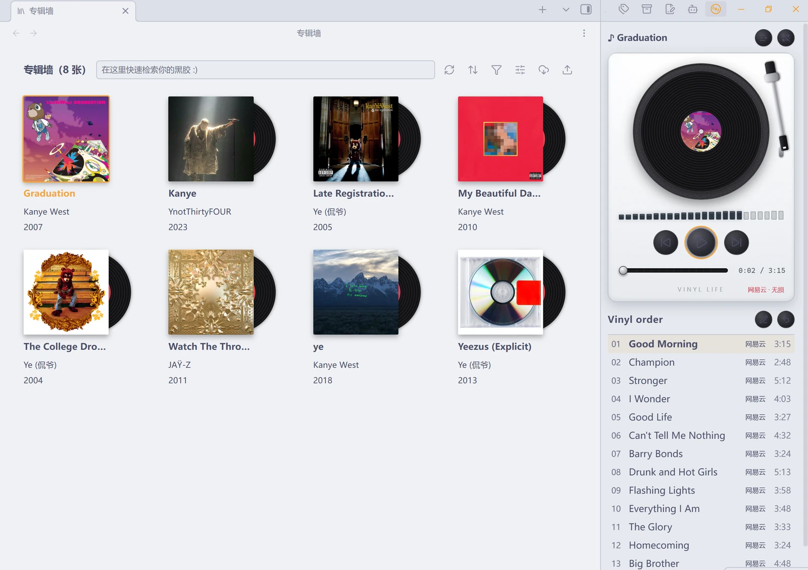
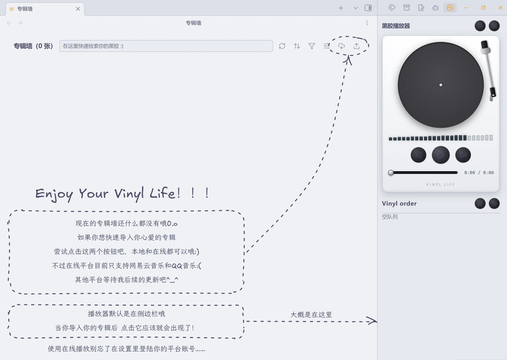

# Vinyl Life

一首歌值得被写下来。

把唱针轻轻搭上，那一秒爆豆子似的静电声。它出现在哪一年、哪个城市、哪一场雨；它陪过你熬过哪一夜；它让你想起谁。这些不该沉在记忆里，也不该变成一个社交平台上的动态。它应该是你自己的一页纸，私人，安静，可以一直放在那儿。

音乐和笔记也许本身有着天然的亲和力。

A song is worth writing down.

Put the needle down, and for a second there is only that crackle — like beans popping. The year it came from, the city, the rain; the night it carried you through; the person it brings back. These things should not sink into memory, and should not become a post on a social platform. They should be a page of your own — private, quiet, somewhere it can stay.

Music and notes may have a natural affinity for each other.

[中文](#中文) | [English](#english)

## 中文

Vinyl Life 把专辑笔记展示成一张张唱片，配有黑胶唱机样式的播放器。可以听电脑里的音乐，也可以接入自己的网易云音乐或 QQ 音乐账号。每张唱片对应一篇普通的 Markdown 笔记，用来记专辑资料、评分，或某次听歌时想到的事。

支持 Obsidian 1.13.0 及以上版本，仅限桌面端。界面可切换中文和 English。

## 专辑墙



专辑以封面卡片排列。鼠标移上去，唱片会从封套里露出来；点击有音源的专辑，会出现唱片从墙上移到唱机的动画。正在播放的专辑会在墙上高亮。

顶部工具栏可以：

- 按专辑名、艺术家或流派搜索。
- 按标题、年份、评分、播放次数或最近播放排序。
- 筛选本地、网易云、QQ 音乐，以及没有音源的收藏专辑。
- 选择卡片显示哪些笔记属性，拖动调整顺序，也可以修改属性的显示名称。
- 导入专辑链接或本地音频。

右键卡片可以打开笔记、补充音频、更换封面，或打开对应的音乐平台页面。没有音源的专辑也能放在墙上，点击会直接打开笔记，适合只收藏资料和写乐评。

## 黑胶播放器

播放器有转动的唱片和随播放状态移动的唱臂，可以放在侧栏、主区标签页，也可以单独开一个窗口。

常用操作都在唱机下方：播放与暂停、上一首与下一首、进度拖动、音量调整。曲目列表可以直接点歌，也可以拖动改变播放顺序。每张专辑会记住自己的排序，下次打开时继续使用；在线专辑还可以恢复平台原有的曲目顺序。

播放器会显示当前音源，在线播放时还会显示音质档位。是否在载入专辑后自动播放，可以在设置中调整。

## 导入音乐

### 本地音频

可以选择文件、选择文件夹，或直接把它们拖进导入窗口。导入时可以新建专辑，也可以给已有专辑添加曲目。

有两种存放方式：

| 方式 | 适合的情况 |
| --- | --- |
| 复制进笔记库 | 希望音频和笔记放在一起，随笔记库管理。 |
| 引用原文件 | 音乐已经整理在电脑或硬盘上，不想再复制一份。插件只记录绝对路径，原文件需要留在该位置。 |

导入整张专辑时，会沿用文件夹名称，并保留 `CD1`、`CD2` 等子目录结构。如果选择的是包含多张专辑的音乐库目录，可以勾选要导入的专辑，批量创建笔记。

也可以直接拖到专辑墙上：放在已有卡片上，就是给这张专辑添加音频；放在空白处，则新建专辑。

可导入的文件扩展名包括 `mp3`、`flac`、`m4a`、`m4b`、`mp4`、`wav`、`ogg`、`oga`、`opus`、`aac`、`webm` 和 `weba`，实际能否播放取决于文件编码及 Obsidian 内置的解码器。其他格式会跳过并提示。本地曲目以文件名作为标题，尚不读取 ID3 等音频标签。

### 网易云音乐和 QQ 音乐

粘贴专辑链接或 ID，插件会获取专辑资料、创建笔记并下载封面。之后可以从专辑墙打开播放。

也可以直接输入专辑或歌曲名搜索：结果里带封面、艺人、发行日期和曲目数，按歌曲搜出来的会注明它出自哪张专辑，点「导入」即按那张专辑建笔记；已经在库里的专辑显示「打开已有专辑」，不会重复导入。

在设置的「源」页面用手机扫码登录自己的账号（目前只保留扫码这一条登录路径）。QQ 的二维码是 QQ 互联二维码，需要用手机 QQ 扫描，QQ 音乐 App 的「扫一扫」识别不了。

在线音源不需要安装 Node.js：首次使用时插件会用 Obsidian 自带的 Node 在应用内启动本机网关；只听本地文件则完全不会启动网关。

## 专辑笔记与听歌记录

每张专辑背后都是一篇笔记。你可以照常添加文字、图片、双链和自定义属性。

已有笔记只要在顶部属性中加入 `album` 标签，就可以被专辑墙识别。例如，以专辑名作为文件名，写入：

```yaml
---
tags: [album]
artist: 艺术家
year: 2024
genre: Jazz
rating: 4
cover: "[[Vinyl Life/covers/专辑封面.jpg]]"
---
```

封面路径换成自己的图片即可。暂时没有音源也没关系，以后可以从卡片右键菜单导入音频。

听歌时有两种记录方式：

- **写到专辑笔记里**：点击播放器的铅笔按钮，在这张专辑的笔记末尾追加时间和当前曲名，然后打开笔记继续写。
- **写到当前笔记里**：执行「插入此刻正在听」命令，在光标位置插入当前专辑和曲目，专辑名会链接回对应笔记。写日记时也可以随手留下一行。

本地导入支持自定义专辑笔记模板。在设置里选择一篇 Markdown 文件，或先生成模板再修改。模板可使用 `{{title}}`、`{{audioFolder}}`、`{{date}}`、`{{time}}`，分别填入专辑名、音频目录、日期和时间。

## 封面与专辑整理

右键专辑，选择「设置封面」，可以使用库里的图片，也可以从电脑上选择图片并复制到封面目录。笔记中的 `cover` 属性也支持图片链接、网络图片地址和纯色色值。

对于库内音频，还可以把 `cover.jpg`、`folder.jpg` 或 `front.jpg` 放进专辑的音频文件夹；在封面目录放入与专辑笔记同名的图片，也能自动识别。没有找到封面时，会显示音符占位。

删除专辑前会弹出确认窗口，可以选择是否一并删除库内音频和封面。被其他专辑引用的文件会保留，库外的原始音频不会被删除。库内文件的删除方式遵循 Obsidian 的「已删除文件」设置。

## 播放统计

在「通用」设置里可以查看累计播放次数、最近听过的专辑和播放最多的专辑。最近播放记录包含上次播放的曲目和时间，也可以从这里清除统计。

统计保存在插件自己的数据文件中，不会自动往专辑笔记里添加播放记录。

## 设置

设置面板是四个标签页，点哪个就地换成哪一页：

| 标签页 | 可以调整的内容 |
| --- | --- |
| 通用 | 界面语言、专辑和封面目录、本地笔记模板、默认音源、在线音质、自动播放、播放器位置，以及播放统计。 |
| 外观 | 专辑墙每行数量、唱片弹出方向、唱片颜色、唱机配色和转盘动画速度。 |
| 源 | 网易云与 QQ 音乐登录、本地音频目录、默认导入方式，以及在线音源运行状态。 |
| 关于 | 版本、作者手记（中英对照）、项目地址和许可信息。整页手绘：文案用手写体，便签外框是一圈手画的虚线。 |

面板由插件自己绘制，所以这些设置在 Obsidian 的全局设置搜索里搜不到 —— 直接打开「设置 → Vinyl Life」看标签页。

唱机有胡桃木、贝壳白和哑光黑三种配色，唱片可选黑、黄、蓝、白。专辑墙可以按窗口宽度自动排版，也可以固定为每行 2—7 张；唱片弹出方向可选上、下、左、右。

默认文件位置如下，均可按自己的习惯修改：

```text
Vinyl Life/
├── Vinyl Note/    专辑笔记
├── covers/        封面图片
└── audio/         复制进库的音频
```

## 安装与开始使用

1. 从 [GitHub Releases](https://github.com/Louiss342/Vinyl-life/releases) 下载 `main.js`、`manifest.json` 和 `styles.css`。
2. 放进笔记库的 `.obsidian/plugins/vinyl-life/` 文件夹。
3. 重新加载 Obsidian，在「设置 → 第三方插件」中启用 Vinyl Life。
4. 在命令面板中搜索 Vinyl Life，打开专辑墙，导入一张专辑。



第一次打开时，空态教程会圈出两个导入按钮，并指出播放器的位置。

如果准备使用网易云或 QQ 音乐，直接在插件的「源」设置页扫码登录即可，无需安装 Node.js。

## 在线音源与数据

网易云和 QQ 音乐通过非官方接口接入，插件与网易、腾讯没有关联。播放范围和音质受账号权限及平台接口状态限制，不绕过付费或会员限制；使用这些接口可能涉及平台的服务条款。

插件不收集遥测或上传播放统计。在线功能会连接所选音乐平台的登录、音乐与图片服务，本机网关只监听 `127.0.0.1`。网关请求外网时跟随系统的代理设置（与浏览器一致）；需要手动指定时，可用 `VINYL_PROXY` 环境变量覆盖。笔记中使用网络封面时，也会访问对应的图片地址。

登录凭据、设置和播放统计保存在本机插件目录中。可以在设置里退出账号、清除统计；分享插件文件时，不要附带自己的 Cookie 和登录数据。

## 权限说明

社区插件审核会列出插件用到的系统能力，这里逐条说明用途。插件只在你的机器上运行，这些能力都只服务于上面写的功能。

- **本地文件读写（Node `fs`）**：按你填写的绝对路径读取库外的音频目录（外链模式）；在插件目录保存登录凭据、设备标识与播放统计；检查插件目录里的 `styles.css` 是否在位（手工安装漏了样式文件就挂出内置副本，避免界面裸奔）；把内联的网关源码落到系统临时目录后再启动（用 Electron 自带的 Node 在应用内运行）。库内笔记、封面和复制进库的音频一律走 Obsidian 的 vault 接口，不直接读写文件系统。
- **应用内网关进程**：在线音源需要本机网关去对接网易云 / QQ 音乐的接口——插件用 Electron 自带的 Node（utility process）在应用内把它启动起来，监听 `127.0.0.1` 上的随机空闲端口；纯本地音源不会启动任何网关。网关随插件卸载 / Obsidian 退出一起回收；启动时还会清理一次旧版本（1.0.8 及更早）用系统 Node 起的遗留进程（读一次进程命令行，确认目标确实是本插件启动的，以免误杀别的程序）。
- **网关鉴权**：网关虽然只监听 `127.0.0.1`，但本机上任何程序、浏览器里的任何页面都能扫到这个端口。所以每次启动网关都会生成一个随机 token 交给它，插件发出的每个请求都必须带上；没有 token 的请求一律拒绝，网关也不发任何 CORS 头。封面的网络代理另有护栏：只允许 http(s)、目标地址不能是本机或内网、只接收图片，并限时 10 秒、限 12 MB。
- **列举库内文件**：专辑墙要找出所有带 `tags: [album]` 的笔记，因此会枚举库内 Markdown 笔记与图片的路径（封面选择器）。除此之外不读取笔记内容。

## 开发与构建

需要 Node.js 18 或以上版本和 npm。

```bash
npm install
npm run build
npm run typecheck
npm run lint
npm test
```

- `npm install`：安装依赖。
- `npm run build`：构建，产出 `main.js`（插件本体）、`server.js`（本地网关，独立调试用）和 `src/core/gateway-bundle.ts`、`src/core/style-bundle.ts`（这两个是构建生成物，勿手改）。
- `npm run typecheck`：类型检查。它依赖 build 先生成 `src/core/gateway-bundle.ts` 与 `src/core/style-bundle.ts`，两步顺序不能反。
- `npm run lint`：ESLint（含官方审核规则集），提交前保持零报错。
- `npm test`：跑测试，200 多项，纯 Node 环境，不需要 Obsidian。
- `main.js` 有体积预算（348 KB，超出直接构建失败）：它是社区市场的下载主体，预算写在 `esbuild.config.mjs`。其中约 47 KB 是手写体（拉丁 Excalifont + 中文霞鹜文楷子集，空态教程与设置「关于」页共用，见 `assets/fonts/`）、约 26 KB 是手绘笔触引擎 roughjs。

源码目录结构：

- `src/core`：专辑索引、队列、播放引擎、本地源、网关管理与登录。
- `src/views`：专辑墙、播放器与各类弹窗。
- `src/animation`：交接动效。
- `server/`：本地网关源码，构建时内联进 `main.js`。
- `styles.css`：界面样式；构建时同样内联一份进 `main.js`（手工安装漏掉样式文件时的兜底，见 `src/core/style-fallback.ts`）。

本地调试时，把 `main.js`、`manifest.json` 和 `styles.css` 放进 `<vault>/.obsidian/plugins/vinyl-life/`，重新加载 Obsidian 即可。

发布时推送 tag，GitHub Actions 会自动构建并创建 Release，附上 `main.js`、`manifest.json` 和 `styles.css`。

## 许可与致谢

[MIT](LICENSE) © 2026 Louiss342

本地网关使用了 [NeteaseCloudMusicApi](https://github.com/Binaryify/NeteaseCloudMusicApi) 的部分接口模块，原项目采用 MIT 许可。

空态教程的手绘笔触（虚线框、虚线圈、箭头）用 [roughjs](https://github.com/rough-stuff/rough)，与 Excalidraw 内部同款引擎，MIT 许可。

专辑墙空态教程的手写体是两个子集（内联在 `styles.css` 里，随样式表分发）：

- 拉丁：[Excalidraw](https://github.com/excalidraw/excalidraw) 的 **Excalifont**，字体名 `Vinyl Hand`；
  Excalifont © 2024 by Excalidraw，SIL Open Font License 1.1
- 中文：[**霞鹜文楷 LXGW WenKai**](https://github.com/lxgw/LxgwWenKai)，字体名 `Vinyl Hand CJK`；
  © 2021-2026 LXGW，SIL Open Font License 1.1

两者都是按本插件教程文案裁出的子集（属 OFL 定义的修改版本，故不沿用原字体名），
授权全文与再生成步骤见 [`assets/fonts/`](assets/fonts/)。Excalifont 是 Excalidraw 的商标、
霞鹜文楷与 LXGW 是 LXGW 的保留名称，本项目与这两个项目均无从属关系。

---

## English

Vinyl Life presents album notes as records on a shelf, with a turntable-style player. You can listen to music on your computer, or connect your own NetEase Cloud Music or QQ Music account. Each record is an ordinary Markdown note, for album details, ratings, or whatever you happened to think about while listening.

Requires Obsidian 1.13.0 or later, desktop only. The interface can be switched between Chinese and English.

## Album shelf


Albums are laid out as cover cards. Hover over one and the record slides out of its sleeve; click an album that has audio and the record animates from the shelf to the turntable. The album that is playing is highlighted on the shelf.

The toolbar at the top lets you:

- Search by album name, artist, or genre.
- Sort by title, year, rating, play count, or recently played.
- Filter by local, NetEase, or QQ Music, as well as collected albums that have no audio.
- Choose which note properties the cards show, drag to reorder them, and rename how a property is displayed.
- Import an album link or local audio.

Right-clicking a card lets you open the note, add audio, change the cover, or open the matching page on the music platform. Albums with no audio can sit on the shelf too; clicking them opens the note directly, which suits collecting information and writing reviews.

## Vinyl player

The player has a spinning record and a tonearm that moves with the playback state, and it can live in the sidebar, in a main-area tab, or in a window of its own.

The controls you reach for most sit below the turntable: play and pause, previous and next track, scrubbing, and volume. The track list lets you click a song to play it, or drag to change the playing order. Each album remembers its own ordering and keeps using it the next time you open it; for online albums you can also restore the platform's original track order.

The player shows the current source, and for online playback the quality tier as well. Whether playback starts automatically after an album loads can be changed in the settings.

## Importing music

### Local audio

You can pick files, pick a folder, or simply drag them into the import window. When importing, you can create a new album or add tracks to an existing one.

There are two ways to store the files:

| Method | When it fits |
| --- | --- |
| Copy into the vault | When you want the audio to sit alongside the notes and be managed with the vault. |
| Reference the original files | When your music is already organized on your computer or a drive and you would rather not make a second copy. The plugin only records the absolute path, and the original files need to stay where they are. |

When you import a whole album, the folder name is carried over and subdirectories such as `CD1` and `CD2` are preserved. If you pick a music library folder that holds several albums, you can tick the albums you want and create the notes in bulk.

You can also drag files straight onto the album shelf: drop them on an existing card to add audio to that album, or on empty space to create a new album.

The file extensions you can import are `mp3`, `flac`, `m4a`, `m4b`, `mp4`, `wav`, `ogg`, `oga`, `opus`, `aac`, `webm`, and `weba`; whether a file actually plays depends on its encoding and on Obsidian's built-in decoders. Other formats are skipped with a notice. Local tracks use the file name as their title; audio tags such as ID3 are not read yet.

### NetEase Cloud Music and QQ Music

Paste an album link or ID and the plugin fetches the album information, creates a note, and downloads the cover. After that you can open it from the album shelf and play it.

You can also search by album or song name. Each result shows its cover, artists, release date, and track count; a song result tells you which album it comes from, and clicking Import creates that album's note. Albums already in your vault show an Open existing album button instead of being imported twice.

Sign in by scanning a QR code on the Sources settings page (for now this is the only sign-in path). The QQ code is a QQ Connect QR code — scan it with mobile QQ; the QQ Music app's own scanner cannot read it.

Online sources do not require Node.js: on first use the plugin starts a local gateway in-app, on the Node bundled with Obsidian. If you only listen to local files, no gateway is started at all.

## Album notes and listening log

Behind every album is a note. You can add text, images, wikilinks, and custom properties as usual.

An existing note is recognized by the album shelf as long as you add the `album` tag to its frontmatter. For example, with the album name as the file name, write:

```yaml
---
tags: [album]
artist: 艺术家
year: 2024
genre: Jazz
rating: 4
cover: "[[Vinyl Life/covers/专辑封面.jpg]]"
---
```

Just point the cover path at your own image. Having no audio yet is fine — you can import audio later from the card's right-click menu.

There are two ways to write things down while listening:

- **Into the album note**: click the pencil button in the player to append the time and the current track name to the end of that album's note, then open the note and carry on writing.
- **Into the current note**: run the Insert the currently playing track command to insert the current album and track at the cursor; the album name links back to its note. Handy for leaving a line while you are writing your journal, too.

Local imports support a custom album note template. Choose a Markdown file in the settings, or generate a template first and then edit it. The template can use `{{title}}`, `{{audioFolder}}`, `{{date}}`, and `{{time}}`, which are filled in with the album name, the audio folder, the date, and the time.

## Covers and album organization

Right-click an album and choose Set cover to use an image from the vault, or pick an image from your computer and copy it into the cover folder. The `cover` property in a note also accepts image links, remote image URLs, and solid color values.

For audio inside the vault, you can also put `cover.jpg`, `folder.jpg`, or `front.jpg` into the album's audio folder; an image in the cover folder with the same name as the album note is picked up automatically as well. When no cover is found, a music-note placeholder is shown.

Deleting an album brings up a confirmation window where you can choose whether to delete the in-vault audio and covers along with it. Files referenced by other albums are kept, and original audio outside the vault is never deleted. How in-vault files are deleted follows Obsidian's Deleted files setting.

## Playback statistics

The General settings show the cumulative play count, the albums you played recently, and the albums you played most. The recent list includes the last track played and the time it was played, and you can clear the statistics from here as well.

Statistics are stored in the plugin's own data file; play records are never added to your album notes automatically.

## Settings

The settings panel is four tabs; clicking a tab switches the content in place:

| Tab | What you can adjust |
| --- | --- |
| General | Interface language, album and cover folders, the local note template, the default source, online audio quality, autoplay, player position, and playback statistics. |
| Appearance | How many albums per row on the shelf, which way records slide out, record color, turntable color scheme, and platter animation speed. |
| Sources | NetEase and QQ Music sign-in, the local audio folder, the default import method, and the status of the online source runtime. |
| About | Version, the author's note (Chinese and English side by side), the project URL, and license information. The whole page is hand-drawn: the text uses a handwriting font, and a dashed frame is sketched around the note. |

The panel is drawn by the plugin itself, so these settings do not show up in Obsidian's global settings search — open Settings → Vinyl Life and use the tabs.

The turntable comes in walnut, shell white, and matte black, and records come in black, yellow, blue, and white. The shelf can lay itself out to fit the window width, or be pinned to 2–7 per row; records can slide out upwards, downwards, leftwards, or rightwards.

The default file locations are as follows, and all of them can be changed to suit your own habits:

```text
Vinyl Life/
├── Vinyl Note/    专辑笔记
├── covers/        封面图片
└── audio/         复制进库的音频
```

## Installation and getting started

1. Download `main.js`, `manifest.json`, and `styles.css` from [GitHub Releases](https://github.com/Louiss342/Vinyl-life/releases).
2. Put them into your vault's `.obsidian/plugins/vinyl-life/` folder.
3. Reload Obsidian and enable Vinyl Life under Settings → Community plugins.
4. Search for Vinyl Life in the command palette, open the album shelf, and import an album.


The first time you open it, the empty-shelf tutorial rings the two import buttons and points out where the player lives.

To use NetEase Cloud Music or QQ Music, just scan the QR code on the plugin's Sources settings page — no Node.js installation is required.

## Online sources and data

NetEase Cloud Music and QQ Music are reached through unofficial APIs, and the plugin is not affiliated with NetEase or Tencent. What you can play and at what quality is limited by your account's permissions and by the state of the platforms' APIs; paid or membership restrictions are not bypassed. Using these APIs may fall under the platforms' terms of service.

The plugin collects no telemetry and uploads no playback statistics. Online features connect to the login, music, and image services of the music platform you choose, and the local gateway only listens on `127.0.0.1`. Requests the gateway makes to the outside world follow your system proxy settings (the same ones your browser uses); set the `VINYL_PROXY` environment variable to override them. When a note uses a remote cover, the corresponding image URL is fetched as well.

Login credentials, settings, and playback statistics are stored in the plugin folder on your own machine. You can sign out and clear the statistics in the settings; when you share plugin files, do not include your own cookies and login data.

## Permissions

Community plugin reviews list the system capabilities a plugin uses; here is what each one is for. The plugin runs only on your own machine, and every capability below serves the features described above.

- **Local file access (Node `fs`)**: reading audio folders outside the vault that you reference by absolute path (linked mode); keeping login credentials, the device identifier, and playback statistics in the plugin folder; checking whether `styles.css` is present in the plugin folder (if missing, a built-in copy is applied so the UI stays styled); and writing the inlined gateway source to the system temp folder before launching it (it runs in-app on Electron's bundled Node). Notes, covers, and audio copied into the vault all go through Obsidian's vault API instead.
- **In-app gateway process**: online sources need a local gateway to talk to the NetEase Cloud Music and QQ Music APIs — the plugin launches it in-app with Electron's bundled Node (utility process), listening on a random free port on `127.0.0.1`. Local audio starts no gateway. The gateway is reclaimed when the plugin unloads or Obsidian exits; on startup the plugin also cleans up the gateway process left behind by older versions (1.0.8 and earlier) that ran on system Node.js (that step reads the process command line once to confirm the target really is a gateway this plugin started, so it never kills an unrelated program).
- **Gateway authentication**: the gateway listens on `127.0.0.1` only, but any process on the machine — including a web page in a browser — can scan for that port. So every launch generates a random token for the gateway, and each request the plugin sends carries it; requests without the token are rejected, and the gateway sends no CORS headers at all. The cover proxy has its own guard rails: http(s) only, the target must not resolve to the local machine or a private network, only images are accepted, and it is capped at 10 seconds and 12 MB.
- **Scanning vault files**: the album shelf needs to find every note tagged `tags: [album]`, so it enumerates the paths of Markdown notes in the vault, and the cover picker lists images in the vault. Nothing else is read from your notes.

## Development

Requires Node.js 18 or later and npm.

```bash
npm install
npm run build
npm run typecheck
npm run lint
npm test
```

- `npm install`: install dependencies.
- `npm run build`: build, producing `main.js` (the plugin itself), `server.js` (the local gateway, for standalone debugging), and `src/core/gateway-bundle.ts` / `src/core/style-bundle.ts` (both generated — do not edit them by hand).
- `npm run typecheck`: type-check. It depends on `npm run build` having generated `src/core/gateway-bundle.ts` / `src/core/style-bundle.ts` first, so the order cannot be reversed.
- `npm run lint`: ESLint with the official review rule set; keep it clean before committing.
- `npm test`: run the tests — 200+ of them, in plain Node, with no Obsidian required.
- `main.js` has a size budget (348 KB; exceeding it fails the build) because it is what the community store downloads — the budget lives in `esbuild.config.mjs`. About 47 KB of it is the handwriting fonts (Latin Excalifont + Chinese LXGW WenKai subsets, shared by the empty-shelf tutorial and the About settings page; see `assets/fonts/`) and ~26 KB is roughjs, the hand-drawn stroke engine.

Source layout:

- `src/core`: album index, queue, playback engine, local source, gateway management, and sign-in.
- `src/views`: album shelf, player, and the various modals.
- `src/animation`: handoff animation.
- `server/`: the local gateway source, inlined into `main.js` at build time.
- `styles.css`: the UI styling; a copy is also inlined into `main.js` at build time as a fallback for installs missing the stylesheet (see `src/core/style-fallback.ts`).

To debug locally, put `main.js`, `manifest.json`, and `styles.css` into `<vault>/.obsidian/plugins/vinyl-life/` and reload Obsidian.

To release, push a tag: GitHub Actions builds the plugin and creates a Release automatically, with `main.js`, `manifest.json`, and `styles.css` attached.

## License and acknowledgements

[MIT](LICENSE) © 2026 Louiss342

The local gateway uses some API modules from [NeteaseCloudMusicApi](https://github.com/Binaryify/NeteaseCloudMusicApi), which is released under the MIT license.

The hand-drawn strokes in the tutorial (dashed boxes, ring, arrows) use [roughjs](https://github.com/rough-stuff/rough), the same engine Excalidraw uses internally (MIT).

The hand-drawn fonts in the empty-shelf tutorial are two subsets inlined in `styles.css`
(they ship with the stylesheet):

- Latin: **Excalifont** from [Excalidraw](https://github.com/excalidraw/excalidraw), family name `Vinyl Hand`;
  Excalifont © 2024 by Excalidraw, SIL Open Font License 1.1
- Chinese: [**LXGW WenKai**](https://github.com/lxgw/LxgwWenKai), family name `Vinyl Hand CJK`;
  © 2021-2026 LXGW, SIL Open Font License 1.1

Both are subsets cut to this plugin's tutorial text (modified versions under the OFL, hence
the new family names) — see [`assets/fonts/`](assets/fonts/) for the full licenses and how to
regenerate them. Excalifont is a trademark of Excalidraw and LXGW WenKai / LXGW are reserved
names of their author; this project is not affiliated with either.
