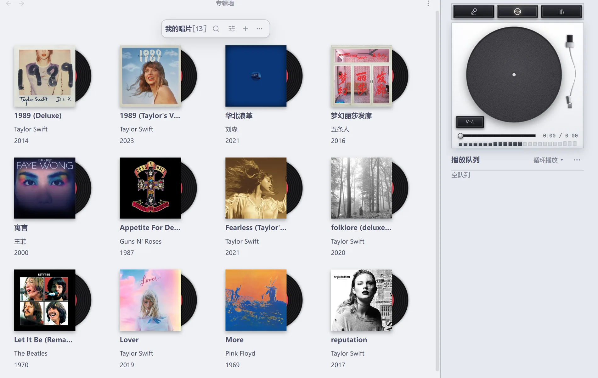
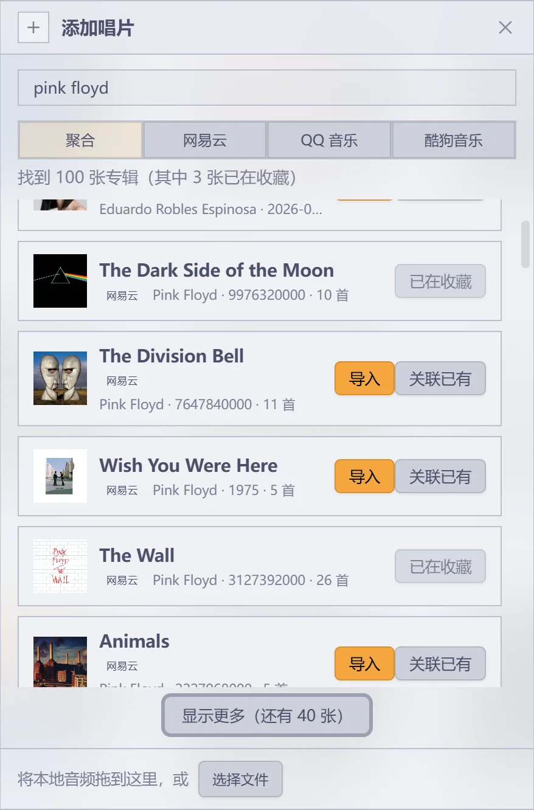
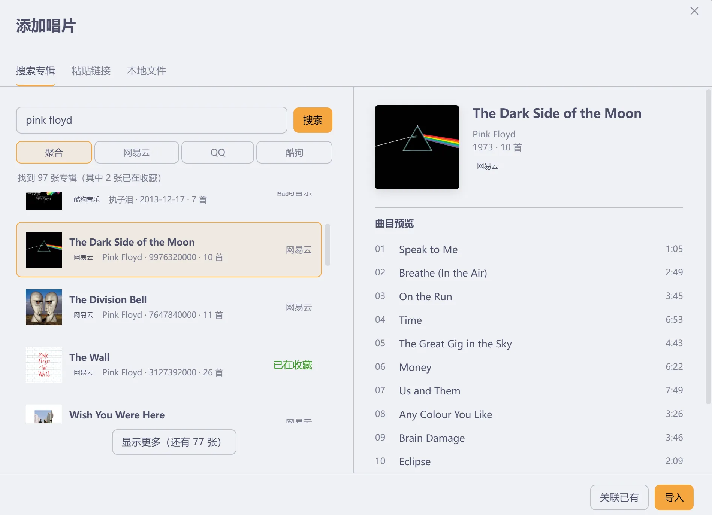
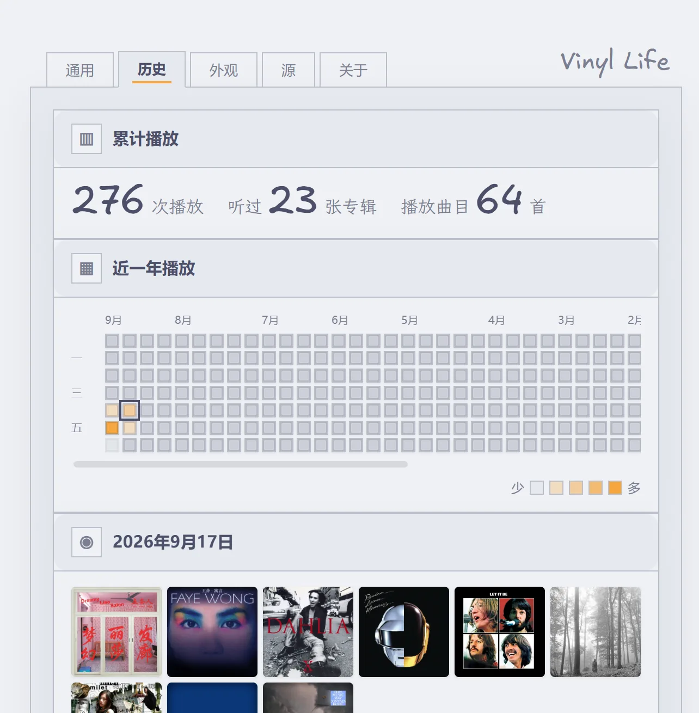
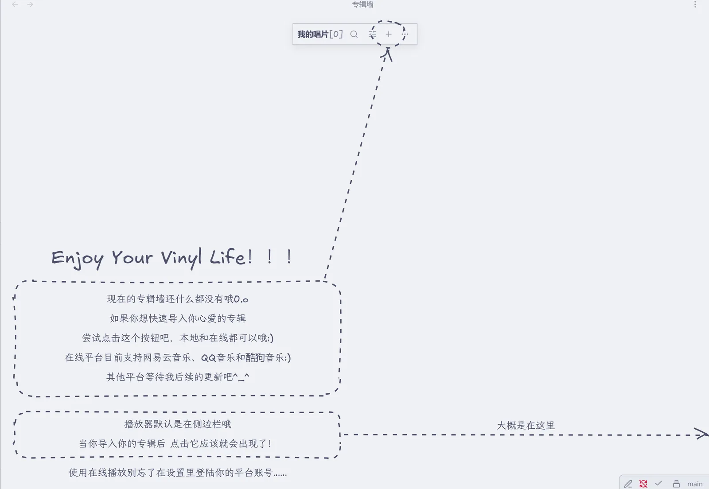
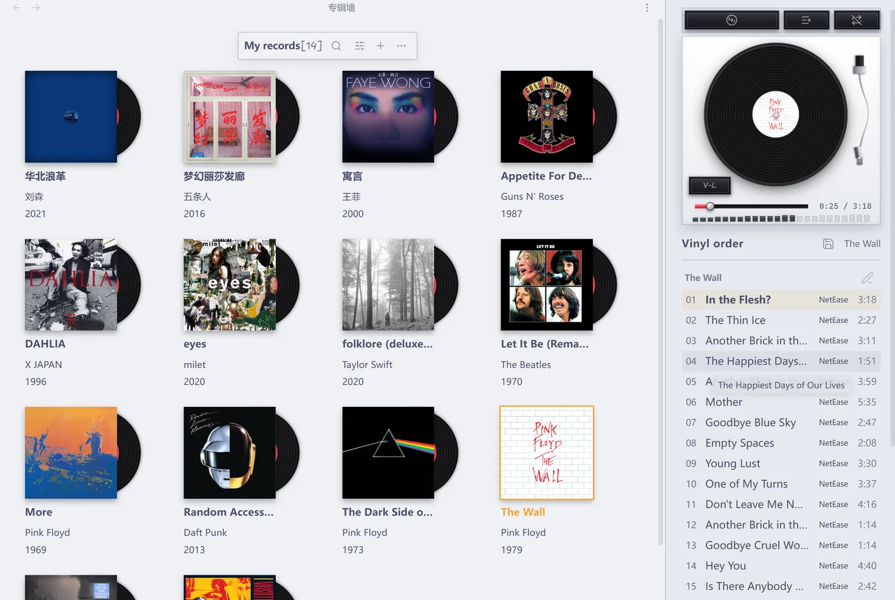
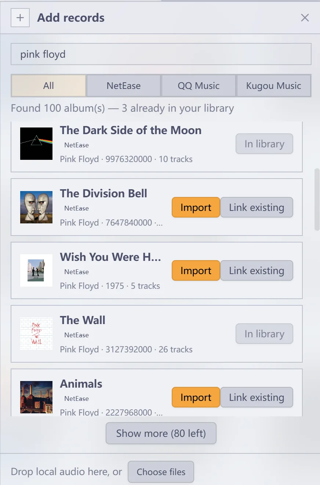
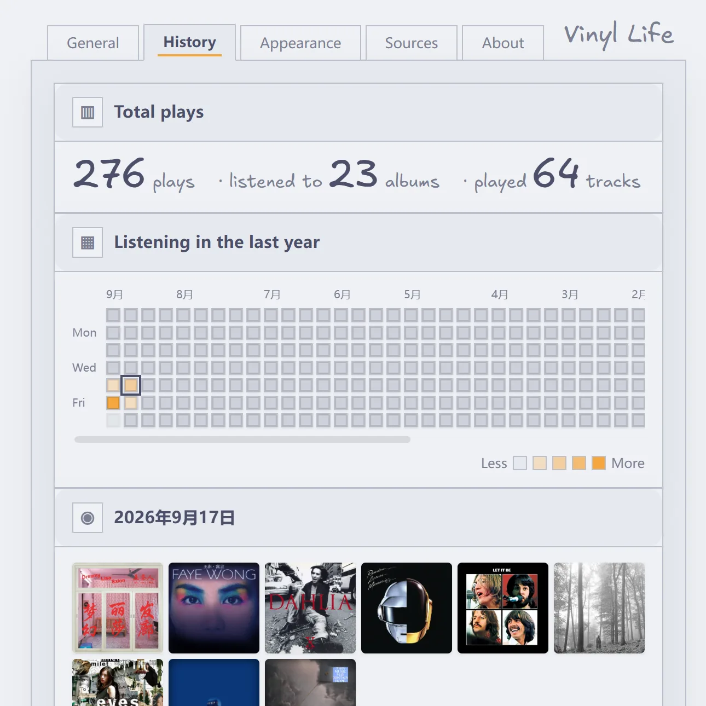
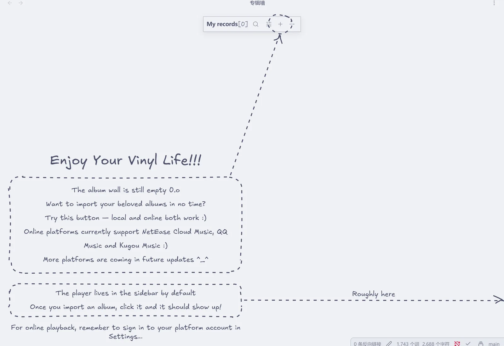

# Vinyl Life
[中文](#中文) | [English](#english)
## 中文

一首歌值得被写下来。 

把唱针轻轻搭上，那一秒爆豆子似的静电声。它出现在哪一年、哪个城市、哪一场雨；它陪过你熬过哪一夜；它让你想起谁。这些不该沉在记忆里，也不该变成一个社交平台上的动态。它应该是你自己的一页纸，私人，安静，可以一直放在那儿。

音乐和笔记也许本身有着天然的亲和力。


### 目录
- [1、项目简介](#1、项目简介)
  - [1.1 项目初衷](#1.1%20项目初衷)
  - [1.2 设计原则](#1.2%20设计原则)
  - [1.3 项目基础](#1.3%20项目基础)
- [2、核心概念](#2、核心概念)
  - [2.1 术语](#2.1%20术语)
  - [2.2 音源与选源](#2.2%20音源与选源)
- [3、功能与流程](#3、功能与流程)
  - [3.1 功能板块](#3.1%20功能板块)
  - [3.2 使用流程](#3.2%20使用流程)
- [4、产品界面框架](#4、产品界面框架)
  - [4.1 界面总览](#4.1%20界面总览)
  - [4.2 专辑墙](#4.2%20专辑墙)
  - [4.3 黑胶播放器](#4.3%20黑胶播放器)
  - [4.4 设置面板](#4.4%20设置面板)
- [5、技术与数据框架](#5、技术与数据框架)
  - [5.1 代码分层](#5.1%20代码分层)
  - [5.2 运行时清单](#5.2%20运行时清单)
  - [5.3 数据归属](#5.3%20数据归属)
  - [5.4 专辑笔记的 frontmatter 键](#5.4%20专辑笔记的%20frontmatter%20键)
  - [5.5 默认目录](#5.5%20默认目录)
- [6、使用手册](#6、使用手册)
  - [6.1 专辑墙](#6.1%20专辑墙)
    - [6.1.1 工具栏](#6.1.1%20工具栏)
    - [6.1.2 搜索](#6.1.2%20搜索)
    - [6.1.3 陈列](#6.1.3%20陈列)
    - [6.1.4 添加](#6.1.4%20添加)
    - [6.1.5 更多](#6.1.5%20更多)
    - [6.1.6 收藏健康检查](#6.1.6%20收藏健康检查)
    - [6.1.7 卡片右键与换碟](#6.1.7%20卡片右键与换碟)
  - [6.2 黑胶播放器](#6.2%20黑胶播放器)
    - [6.2.1 页面结构](#6.2.1%20页面结构)
    - [6.2.2 唱机与唱臂](#6.2.2%20唱机与唱臂)
    - [6.2.3 搓碟](#6.2.3%20搓碟)
    - [6.2.4 唱片面](#6.2.4%20唱片面)
    - [6.2.5 歌词](#6.2.5%20歌词)
    - [6.2.6 曲目队列](#6.2.6%20曲目队列)
    - [6.2.7 队列笔记](#6.2.7%20队列笔记)
  - [6.3 导入音乐](#6.3%20导入音乐)
    - [6.3.1 本地音频](#6.3.1%20本地音频)
    - [6.3.2 在线搜索与链接导入](#6.3.2%20在线搜索与链接导入)
    - [6.3.3 关联已有](#6.3.3%20关联已有)
    - [6.3.4 登录与播放权限](#6.3.4%20登录与播放权限)
  - [6.4 专辑笔记与听歌记录](#6.4%20专辑笔记与听歌记录)
    - [6.4.1 笔记结构](#6.4.1%20笔记结构)
    - [6.4.2 两种听歌记录](#6.4.2%20两种听歌记录)
    - [6.4.3 专辑笔记模板](#6.4.3%20专辑笔记模板)
  - [6.5 封面与专辑整理](#6.5%20封面与专辑整理)
    - [6.5.1 设置封面](#6.5.1%20设置封面)
    - [6.5.2 自动识别封面](#6.5.2%20自动识别封面)
    - [6.5.3 删除专辑](#6.5.3%20删除专辑)
  - [6.6 播放统计](#6.6%20播放统计)
    - [6.6.1 数据管理](#6.6.1%20数据管理)
    - [6.6.2 历史页](#6.6.2%20历史页)
    - [6.6.3 导出统计笔记](#6.6.3%20导出统计笔记)
  - [6.7 设置](#6.7%20设置)
    - [6.7.1 五个标签页](#6.7.1%20五个标签页)
    - [6.7.2 外观](#6.7.2%20外观)
    - [6.7.3 默认目录](#6.7.3%20默认目录)
  - [6.8 命令与快捷键](#6.8%20命令与快捷键)
- [7、安装与开始使用](#7、安装与开始使用)
- [8、在线音源与数据](#8、在线音源与数据)
  - [8.1 接入方式与边界](#8.1%20接入方式与边界)
  - [8.2 网络与代理](#8.2%20网络与代理)
  - [8.3 登录凭据](#8.3%20登录凭据)
- [9、权限说明](#9、权限说明)
- [10、开发与构建](#10、开发与构建)
  - [10.1 环境与命令](#10.1%20环境与命令)
  - [10.2 体积预算](#10.2%20体积预算)
  - [10.3 源码目录](#10.3%20源码目录)
  - [10.4 本地调试与发布](#10.4%20本地调试与发布)
  - [10.5 相关文档](#10.5%20相关文档)
- [11、许可与致谢](#11、许可与致谢)
<div id="1、项目简介"></div>

### 1、项目简介
<div id="1.1 项目初衷"></div>

#### 1.1 项目初衷
Vinyl Life 是 Obsidian 的桌面插件，本质上来说只实现两件事：把专辑收进笔记库，再把它们放出来听。

收藏的主体是普通的 Markdown 笔记。给一篇笔记加上 `album` 标签，它就会出现在专辑墙上。笔记里写什么、怎么组织，插件一概不管。播放器模拟了一台黑胶唱机，既能放电脑里的音频，也能接上你自己的网易云音乐、QQ 音乐或酷狗音乐账号。

当你启用这个插件以后，你就可以做到：导入一张专辑，它变成墙上的一张唱片，点击即听，听到某一句时随手记一笔，很久以后想起那段旋律回到这张专辑，听见它，然后看到曾经的自己。
<div id="1.2 设计原则"></div>

#### 1.2 设计原则
**笔记是真源。** 专辑资料、评分、听歌记录都写在 Markdown 笔记里，插件不另建一份收藏数据库。删掉插件，笔记还在；换台电脑，收藏跟着笔记库走。

**本地优先。** 只听库内音频时，插件不联网、不登录、不起后台进程。库外音频走本机网关按 HTTP Range 供流，整轨不进内存（见 6.3.1）。在线音源是可选加成，不是使用前提。

**不越权。** 不绕过付费和会员限制，不收集遥测，不上传播放统计。需要联网时，只连你自己选定的那个平台。
<div id="1.3 项目基础"></div>

#### 1.3 项目基础
| 项 | 基础 |
| --- | --- |
| Obsidian 版本 | 1.13.0 及以上 |
| 平台 | 仅桌面端 |
| 界面语言 | 中文、English |
| 安装 | 三个文件（`main.js`、`manifest.json`、`styles.css`）放进插件目录即可，不用另外装 Node.js，也没有需要常驻的服务 |
| 本地音频 | 独立可用，不需要账号或网络；库内音频不起后台进程 |
| 在线音源 | 网易云音乐、QQ 音乐、酷狗音乐，依赖各平台接口与账号权限，可用性由平台决定 |
<div id="2、核心概念"></div>

### 2、核心概念
<div id="2.1 术语"></div>

#### 2.1 术语
| 术语 | 含义 | 落在哪 |
| :-- | --- | --- |
| 专辑笔记 | 带 `album` 标签的普通 Markdown 笔记，一张收藏唱片的长期记录 | 默认在 `Vinyl Life/Vinyl Note/` |
| 专辑版本 | 同名作品的一次具体发行：原版、重制版、现场版、豪华版 | 笔记的 `edition` 属性 |
| 音源 | 给专辑提供可播放曲目的本地文件或在线平台，一张专辑可以挂多个 | `audioFolder`、`neteaseId`、`qqId`、`kugouId` |
| 曲目 | 从选定音源解析出来的一首歌，是播放队列的最小单位 | 播放时解析 |
| 播放队列 | 一次聆听里按顺序排好的曲目，可以跨越多张专辑 | 运行时；可以存成队列笔记 |
| 听歌记录 | 你自己写进笔记的一段文字，可以带上曲名和播放位置 | 笔记正文 |
| 播放事件 | 插件自动记下的一次播放，用来生成统计 | 插件自己的数据文件 |
<div id="2.2 音源与选源"></div>

#### 2.2 音源与选源
没有音源的专辑照样能收在墙上，点开直接进笔记，适合只存资料、只写乐评。要播放时才需要解析音源。

一张专辑可以同时挂着多个音源。播放时按这个顺序自动挑：本地文件 → 网易云 → QQ 音乐 → 酷狗音乐。你也能在笔记属性或设置页里指定用哪个。播放失败时，可以从失败提示或卡片右键菜单换一个源再试。
<div id="3、功能与流程"></div>

### 3、功能与流程
<div id="3.1 功能板块"></div>

#### 3.1 功能板块
「主要功能」缺了，收藏、播放或记录这条链就断一环，所以要保证稳定好用、数据不丢；「次级功能」是效率和体验上的加成，可以没有，但不能反过来改变核心的数据结构。

| 板块 | 主要功能 | 次级功能 |
| --- | --- | --- |
| **A. 专辑墙** | 识别专辑笔记；用封面卡片浏览收藏；按专辑、艺人等检索；打开笔记；从墙上选择专辑播放。 | 来源筛选、排序和卡片属性陈列；封面更换；多选及批量删除；唱片交接动画和布局定制。 |
| **B. 音乐导入** | 导入本地音频或在线专辑；创建或补充专辑笔记；解析音源并形成曲目。 | 本地文件/文件夹批量导入、库内复制或库外引用；在线聚合搜索、链接导入、连续添加和重复识别；扫码登录、音质选择。 |
| **C. 播放器** | 专辑与曲目播放、暂停、切歌、进度、音量；队列与播放模式；播放器和唱片墙状态同步。 | 模拟唱臂与唱片动效、搓碟、歌词（逐句高亮、跟随与跳转）、系统媒体键、会话内曲目重排、上次播放状态恢复、独立窗口或侧栏摆放。 |
| **D. 笔记** | 一张专辑对应一篇可自由编辑的 Markdown 笔记；在专辑笔记中追加带时间的听歌记录；向当前笔记插入正在听的内容。 | 本地导入笔记模板、自定义属性、双链与封面约定、无音源收藏、播放位置回跳链接。 |
| **E. 历史** | 自动记录播放事件；查看最近播放、播放最多和日历热力图。 | 按专辑属性分组统计、删除后保留统计快照、导出 Markdown 统计笔记、备份与恢复、清除统计。 |
| **F. 设置与运行支持** | 管理目录、音源、自动播放、账号及语言；确保本地和在线接入正常运行。 | 外观主题、工具栏位置、唱片颜色与动效、收藏健康检查、故障提示、样式兜底。 |
<div id="3.2 使用流程"></div>

#### 3.2 使用流程
1. 导入一张专辑，或者给现有笔记加上 `album` 标签。专辑墙读到笔记，墙上多出一张唱片。
2. 搜索、筛选或翻看收藏，挑一张有音源的唱片。插件按选源顺序解析出曲目队列，交给播放器。
3. 一边听一边可以打开专辑笔记写点什么。播放事件由插件另外记着，用来生成统计。
4. 日后从墙上、笔记里的链接或历史页回到这张专辑，接着听或者接着写。
<div id="4、产品界面框架"></div>

### 4、产品界面框架
<div id="4.1 界面总览"></div>

#### 4.1 界面总览
界面上只有两个视图、一篇篇普通笔记，外加一个自绘的设置面板。

```text
Vinyl Life
├─ 专辑墙（视图）：收藏入口、检索与陈列、添加、选择管理
├─ 黑胶播放器（视图）：唱片架、唱机、曲目队列与播放控制
├─ 专辑笔记（Markdown 笔记）：资料、个人文字、手动听歌记录
└─ 设置面板：通用 / 历史 / 外观 / 源 / 关于，五个标签页就地切换（见 6.7）
```
<div id="4.2 专辑墙"></div>

#### 4.2 专辑墙
工具栏保持单行，只有搜索、陈列、添加、更多四个图标。点开才弹出面板，面板里才有文字和详细操作。进入选择模式时，工具栏整条被临时接管，这样日常浏览和批量管理不会互相干扰。

一张专辑在墙上就是一张封面卡片，鼠标移上去唱片从封套里滑出来。墙上什么都没有时，会显示手绘教程，圈出添加入口并指出播放器的位置。
<div id="4.3 黑胶播放器"></div>

#### 4.3 黑胶播放器
播放器默认开在右侧栏，也可以放进主区标签页，或者单独开一个窗口；默认去哪儿，在「外观 → 播放器」里改。

页面自上而下是按键卡、唱机、唱放三张卡片，再往下是曲目队列。按键卡上是三枚等宽的键——歌词、唱机、唱片架——各翻一个面：唱机面是唱片与唱臂，歌词面逐句跟着唱，唱片架面是三行唱片架，可以翻碟、多选，再一次性加入队列。
<div id="4.4 设置面板"></div>

#### 4.4 设置面板
五个标签页由插件自己绘制，点标签就地换内容，不新开页面。这样做是为了还原设计稿里的浏览器式标签条和手绘「关于」页；代价是这些设置不会出现在 Obsidian 的全局设置搜索里，只能从「设置 → Vinyl Life」进。
<div id="5、技术与数据框架"></div>

### 5、技术与数据框架
<div id="5.1 代码分层"></div>

#### 5.1 代码分层
| 层次 | 职责 | 现有位置 |
| --- | --- | --- |
| 插件装配层 | 注册视图、命令和设置，连接音源服务与播放引擎，管理生命周期。 | `src/main.ts` |
| 界面层 | 渲染专辑墙、播放器、设置、统计和导入/管理面板。 | `src/views/`、`styles.css` |
| 领域与播放层 | 解析专辑笔记、构建曲目队列、管理播放状态、统计事件及外观规则。 | `src/core/` |
| 导入与文件层 | 从本地或平台信息生成笔记、音频引用和封面；处理删除。 | `src/import.ts`、`src/delete.ts` |
| 在线接入层 | 与三家音乐平台通信；按需启动应用内本机网关。 | `src/core/`（`netease.ts` / `qq.ts` / `kugou.ts`）、`server/` |
| 动效层 | 协调唱片墙与播放器之间的视觉交接。 | `src/animation/` |
<div id="5.2 运行时清单"></div>

#### 5.2 运行时清单
| 项 | 数量 | 说明 |
| --- | --- | --- |
| 视图 | 2 | 专辑墙、黑胶播放器；另有 1 枚 ribbon 图标。 |
| 命令 | 16 | 两个视图、两种导入、三条播放控制、队列笔记、听歌记录、封面与源站等（清单见 6.8）。 |
| 设置页 | 5 | 通用、历史、外观、源、关于。 |
| 协议 | 1 | `obsidian://vinyl-life`，供笔记里的播放位置回跳。 |
| 界面语言 | 2 | 中文、English。 |
<div id="5.3 数据归属"></div>

#### 5.3 数据归属
| 数据 | 存在哪 |
| --- | --- |
| 专辑资料、正文、听歌记录 | Markdown 笔记（真源） |
| 复制进库的封面与音频 | 笔记库里（默认 `Vinyl Life/Covers/`、`Vinyl Life/Audio/`） |
| 库外音频 | 只记一条绝对路径，文件留在原地 |
| 设置、登录凭据、播放统计 | 本机插件目录（`data.json` 与凭据文件） |

自动统计不写进专辑笔记。只有你主动点「听歌记录」或执行插入命令时，插件才会改笔记正文。
<div id="5.4 专辑笔记的 frontmatter 键"></div>

#### 5.4 专辑笔记的 frontmatter 键
插件只认下面这些键（一篇笔记被当作专辑，唯一条件是 `tags` 里有 `album`）。**其余键都是你的**：任何自定义属性都能进卡片「封面下的信息」，也能当排序依据 —— 插件不写、不改、不删它们。

| 键 | 谁写 | 取值 | 说明 |
| --- | --- | --- | --- |
| `tags` | 你（导入时也帮你加） | 列表，含 `album` | 专辑墙识别一篇笔记的唯一依据 |
| `cover` | 导入 / 设置封面 | vault 路径、`[[wikilink]]`、图片 URL 或色值 | 卡片封面；没写时按约定在 `cover` / `folder` / `front` 命名里找 |
| `audioFolder` | 本地导入（复制进库） | vault 内文件夹路径 | 整张专辑的音频目录（`CD1` / `CD2` 子目录也扫） |
| `audio` | 本地导入（库外引用）/ 单曲导入 | 列表：vault 路径或绝对路径 | 零散音轨；绝对路径 = 文件留在原地，只记引用 |
| `source` | 你（可选） | `auto` / `local` / `netease` / `qq` / `kugou` | 这张专辑优先用哪个音源；不写就按设置里的顺序 |
| `edition` | 设置专辑版本 / 导入 | 文本 | 同名作品的一次发行形态，卡片上显示成「专辑名 · 版本」 |
| `neteaseId` / `qqId` / `kugouId` | 导入 / 关联已有 | 数字 id | 平台侧身份（酷狗也是数字专辑 id，曲目的 hash 不进笔记）；裸数字默认按网易云 id 解析 |
| `collectOnly` | 收藏健康检查「标记为仅收藏」 | `true` | 明确「这张只收藏，不打算播」——健康检查不再提示它缺音源 |
| `artist` `year` `genre` `label` `country` `version` `catalog` `rating` | 你 | 文本 / 数值 | 插件认识这几个名字（有别名与图标），显示在卡片上并可作为排序依据 |
| 其它任意键 | 你 | 文本 / 数值 / 列表 / 日期 | 同上：能显示、能排序，插件不解释它的含义 |

旧笔记里的 `netease` / `qq` / `kugou`（链接或裸 id）也认，不必手动改。

数值的读法比写法宽：`year: 1997`、`year: "1997年"`、`year: 2003-05` 都读得出年份；`rating: 4`、`rating: "4/5"`、`rating: 4.5` 都读得出评分（卡片菜单「评分」打开一个小弹窗，自己填一个数字：填什么存什么、留空就是清除这个键 —— 不会改写你手写的格式）。

**查询示例**（Dataview；Bases 里用 `tags.contains("album")` 过滤，属性名与上表一致）：

```dataview
TABLE artist AS 艺人, year AS 年份, rating AS 评分, file.mtime AS 更新
FROM #album
WHERE rating >= 4
SORT year DESC, artist ASC
```

```dataview
LIST
FROM #album
WHERE !audioFolder AND !audio AND !neteaseId AND !qqId AND !kugouId
```

第二条查出的是「只收藏、还没接任何音源」的专辑 —— 与健康检查同一套判据；想让它闭嘴，给这些笔记加 `collectOnly: true`。
<div id="5.5 默认目录"></div>

#### 5.5 默认目录
```text
Vinyl Life/
├── Vinyl Note/    专辑笔记
├── Covers/        封面图片
├── Audio/         复制进库的音频（每张专辑在下面各占一个子目录）
├── Stats/         导出的统计笔记
├── Queues/        保存的队列笔记
├── Template/      专辑笔记模板（点「生成模板文件」后才有）
└── Backups/       备份与裁剪归档（点「备份设置与统计」/ 首次裁剪时才有）
```

前五类可以在「通用 → 路径」里改。`Template/` 和 `Backups/` 固定跟在专辑笔记目录的上一级，不单独设。
<div id="6、使用手册"></div>

### 6、使用手册
下面按界面逐个说明。只想先跑起来的话，直接跳到「7、安装与开始使用」。
<div id="6.1 专辑墙"></div>

#### 6.1 专辑墙
<div id="6.1.1 工具栏"></div>

##### 6.1.1 工具栏
工具栏是一张紧凑的浮卡（不透明面 + 发丝边 + 投影，与各功能浮层同一族）：左边是标题与手写体的收藏数量，右边四枚图标——搜索、陈列、添加、更多。

点搜索，输入框在中间出现；清空，或者在没有关键词时失焦，就收回去。

工具栏与浮层沿用设置页那一套样式：发丝线、悬停淡底、分段控件。

在外观页可以选**工具栏位置**：顶部或底部 × 左对齐 / 居中 / 右对齐，六档，默认顶部居中。
<div id="6.1.2 搜索"></div>

##### 6.1.2 搜索
点击图标原位展开输入框，输入即筛。用中文输入法组词时不筛，组完再搜。

已经有搜索或来源筛选时，标题上的数量变成「匹配数/总数」。点 × 清空关键词并回到搜索前的浏览位置；按 Esc 只退出输入焦点，不清空。
<div id="6.1.3 陈列"></div>

##### 6.1.3 陈列
一个浮层统管「看哪些、怎么排、怎么显示」三件事。

- **来源**：本地 / 网易云 / QQ 音乐 / 酷狗音乐 / 无音源收藏，和关键词叠加生效。
- **排列**：依据与方向两个下拉。缺了排序属性的专辑排在最后。
- **显示**：每行数量；「封面下的信息」进第二层，勾选卡片上显示的笔记属性、拖拽调序、改显示名。

筛选不是「全部」时，按钮上会跟着来源名，当前条件在单行里始终看得见。
<div id="6.1.4 添加"></div>

##### 6.1.4 添加
在线搜索和本地导入共用一个浮层，分两层视图。

第一层搜专辑、艺人，或粘贴专辑链接。结果逐条走「导入 → 正在添加… → 打开」，失败就原位重试；已经明确入库的同平台专辑标成「已在收藏」。

把本地音频拖到面板底部，或点「选择文件 / 选择文件夹」，就切到第二层的本地导入：选目标、选落库方式、按「开始导入」。导完留在原地，接着导下一批。「返回添加」回到搜索层，原来的关键词和结果都还在。


<div id="6.1.5 更多"></div>

##### 6.1.5 更多
「更多」里有三个功能。前两个在这一节，第三个内容多，单列成 6.1.6。

一是**选择专辑**：进入选择模式后，工具栏整条切换用途——「已选择 N 张」、全选当前 N 张 / 清空选择 / 删除… / 完成，按 Esc 也能退出。收藏很多时卡片是分批补上的，刚滚到的那些勾选状态会晚一拍，批量删除前停一下确认勾选。

二是**刷新专辑墙**：重新读取笔记，但保留当前的搜索、筛选和陈列状态，不会把你刚排好的版面重置回去。在 Obsidian 外面往库外音频目录里加过歌，也点它一下才会看到——库外目录没有文件监听。
<div id="6.1.6 收藏健康检查"></div>

##### 6.1.6 收藏健康检查
**错误**是真正坏了的东西：失效的库外音频路径、笔记里指定了但不见了的音源、已经发生过的播放失败。

**提示**是没有音源、没有封面——多半是你有意收着的乐评，所以每行带一个「标记为仅收藏」：往笔记里写一条 `collectOnly: true`，这两类提示就不再报（**错误**照报），标记跟着笔记走。

默认扫描不联网。想验证在线地址就点「检查在线播放地址」：选范围（全部 / 仅每张实际会用的 / 仅上次失败的），逐个试播，间隔约 0.35 秒，随时可「中止」，结果与时间留在列表上。它是抽样的——静态扫描只看库外引用还在不在（库内音频坏了查不出），试播每张只从前三首里试到第一个能拿到地址的为止、且按最低音质，所以「通过」只说明这条路通。

一张专辑挂了多个音源时，播放失败可以直接从提示里换源，卡片右键也有换源入口。右键的「设置专辑版本」会写入 `edition` 属性，用来区分原版、重制版和现场版。
<div id="6.1.7 卡片右键与换碟"></div>

##### 6.1.7 卡片右键与换碟
专辑以封面卡片排列。鼠标移上去，唱片从封套里露出来；点一张有音源的专辑，唱片会从墙上移到唱机 —— 那只空出来的封套就是墙上唯一一处「这张在播」的标记，卡片本身不变色（点卡片是「我要听它」，不是「选中它」）。

右键卡片是整套菜单：打开笔记 / 导入本地音频… / 设置封面… / 评分 / 设置专辑版本 / 在〈平台〉打开 / 选择多张 / 删除专辑…（挂了多个音源时多一项「切换音源」；`Shift + F10` 等价于右键）。没有音源的专辑也能放在墙上，点它会打开笔记，并说一句「该专辑暂无音源（…），已打开笔记」。

点击卡片就是换碟：唱片从墙上被抽走、交给播放器。开着专辑队列模式时，点击变成「排到队尾」，排进去的唱片同样离墙；关掉队列模式，队列收敛回当前专辑，排在后面的唱片再滑回来。
<div id="6.2 黑胶播放器"></div>

#### 6.2 黑胶播放器
<div id="6.2.1 页面结构"></div>

##### 6.2.1 页面结构
整页自上而下：按键卡、唱机、唱放、曲目队列。按键卡上三枚等宽的键——歌词、唱机、唱片架——各翻一个面，当前那面亮着；点中间那枚回到唱机。

播放 / 暂停是唱机左下角的长方形按键：黑色键面、边缘两道浅线，卡在唱盘圆外、微微探出转角；键面是手写体的「V-L」。播放中它点亮、缓慢呼吸；暂停时暗下来。

唱放卡里是进度与音量：音量是 24 格电平表，点哪格亮到哪格；进度条按下先跟手预览，抬手才跳转。
<div id="6.2.2 唱机与唱臂"></div>

##### 6.2.2 唱机与唱臂
唱片会转，唱臂有两个姿态。

按暂停是断电滑停：转盘在零点几秒里减速停下，转速掉多少音高就掉多少（真唱机断电就是这个声音），声音沿同一条曲线淡出。唱片停在哪个角度就是哪个角度，不摆正、不归零；再按播放是马达起转，从同一角度转起来、声音淡入。滑停到一半再按播放，就在半路接上。

不播放或暂停时，唱针归位到支架上。播放时唱针落在唱片上，此时唱针到唱片圆心的距离，就是这张专辑播到了哪里。

换曲不走这两段斜坡：真唱机上换曲时转盘一直在转，只有「开始 / 停止」才动马达。系统开着「减少动态效果」时两段斜坡都不做（那种模式下盘面本来就不转），暂停是直停。
<div id="6.2.3 搓碟"></div>

##### 6.2.3 搓碟
鼠标按在唱片上拖动，唱片跟着手转，声音跟着转速走。前后拖都出声：往前拖是把那一段按手速变调，转速变多少音高就变多少，和真唱片一样；倒着拖就倒着放。

松手后马达把转速拉回，音乐从唱片停下的位置继续。起手要转过一点角度才算数，所以点一下唱片不会按停音乐。手在盘上时唱针落在槽里，进度、读数与唱臂都跟着手走。

换算基准是设置里的转盘转速：标准档 1.8 秒一圈，正是 33⅓ RPM。暂停中也能搓，唱片停在松手的位置，等于手动定位。

声音分两条路，但你听到的永远是针位上的那一段。

- **完整档**把整轨解码进内存（约 10 MB/分钟），正反都有声，开播几秒后自动备好，手按上去通常就是它（不想让它自动下载整轨，可关掉预载开关）。边界：长音轨降采样、特别长的退回轻量档（设置里仍写着「完整」），这时倒着拖可能没声音。
- **轻量档**是没备好之前的兜底：元素按倍速出声、音高跟着手速走（关掉「保音高」，那是变速不变调的时间拉伸，听着像慢放）。每次出声前先对到针位上，所以它只是「倒着拖那一半没声」，不会听到别的段落；缓冲备好后，这一程余下交给完整档。
- 解码好的份按最近使用留着，回头再搓是现成的；超出预算就丢最久没用过的那份。不想付这份内存，可在设置里换成轻量档：零内存、零预载。
<div id="6.2.4 唱片面"></div>

##### 6.2.4 唱片面
顶部的「唱片架」会让「唱机 + 唱放」这对卡片像立方体一样转到背面。那一面是三行唱片架，按键卡和下面的队列都不动。

横着划过时，三行会错开一点，形成视差。指针停在哪张，哪张就从侧脊放倒、摊开成整张封面。

点一张即换碟；在专辑队列模式下点一张是排到队尾。按住 Ctrl（macOS 是 ⌘）点可以多选，Shift 点连选一段，选好后一次「加入队列」。
<div id="6.2.5 歌词"></div>

##### 6.2.5 歌词
顶部的「歌词」翻到歌词面，翻过去才开始取词：在线音源同一首本次会话只取一次（来回翻面不重复打网），本地音轨每次重读一遍文件。

取词按当前曲目的音源走：

- **网易云**：官方歌词与翻译（`tlyric`），译文跟在正文下面一行。
- **QQ 音乐**：官方歌词与翻译（`trans`）。
- **酷狗音乐**：按「歌手 + 曲名 + 时长」搜词再下载。上游一次回几十条候选，插件按曲名、歌手与时长挑最对得上的一条（直接取第一条常是别人上传的词）。酷狗只有一条歌词轨，没有翻译。
- **本地音频**：认与音频同目录、同名的 `.lrc` 旁挂文件（`song.lrc` / `song.flac.lrc` 都行，UTF-8 与 GBK 都解得开）；库外的扩展名必须全小写 `.lrc` 或全大写 `.LRC`，`.Lrc` 找不到（库内不区分）。**不读内嵌歌词**（ID3 / Vorbis）——解音频容器要多背依赖，为一句歌词不划算。

在线取词失败时，画面上也会显示成「这首歌还没有歌词」——翻回唱机再翻过来，它会重试一次。

**跟着唱**：正在唱的那句有底色，随这一句从左往右刷过去；画面连续滚动——两行之间的时间也在走，唱到哪画面到哪。没有文字的时间戳（间奏）画成一枚音符。

**翻着看**：滚轮或拖动，滚到哪哪句亮；停手 4 秒后平滑滑回正在唱的那句（系统开了「减少动态效果」就直接到位）。

**跳到某一句**：点某行即跳到那一刻并恢复跟随（每行都是按钮，Enter / 空格可用）。歌词里带 `[offset:+500]` 这类全局补偿也认（正值 = 整篇提前）。

歌词只在播放器里显示：不写进专辑笔记，也不进统计；在线歌词的缓存只在本次会话内，退出即散。
<div id="6.2.6 曲目队列"></div>

##### 6.2.6 曲目队列
曲目列表可以直接点歌，也可以拖动改顺序——只影响本次会话，下次打开仍是发行顺序。每行标着音源与时长。

「播放队列」标题右边是播放模式（顺序 / 循环 / 随机），点开直接选、非顺序时亮着；再右边的「⋯」（队列模式开着时也亮）里是：专辑队列模式开关、保存与载入队列笔记、定位到正在播放、清空队列（先确认一次）。

每张专辑的名字末尾有个小按键：点一下，往那张专辑的笔记追加一条带时间戳的听歌记录。

载入专辑后默认直接开播（「通用 → 播放」里可关）。顺序播完会停在暂停，按播放把最后一首重放一遍；队列第一首按「上一首」没动静；某首放不出来会自动跳到下一首并说一声。下次打开 Obsidian 回到上次的专辑与进度，同样停在暂停。
<div id="6.2.7 队列笔记"></div>

##### 6.2.7 队列笔记
「播放队列」旁「⋯」菜单里的「保存队列为笔记」把当前跨专辑队列写成 Markdown 清单，默认落在「队列笔记目录」（设置 → 通用 → 路径）；「从当前笔记载入队列」在同一个菜单里，命令面板里也有同一条命令。

**清单里的曲目列表就是队列本身**：每行一首，形如 `- [[专辑笔记]] · 曲名`。增删改这些行之后，执行命令「从当前笔记载入队列」，载入结果就跟着列表走。

曲目按「专辑笔记 + 曲名」还原：精确匹配优先；专辑那侧多一截后缀（如 `(Remastered)`）且只有一个候选时才认。对不上的整行跳过，并在提示里点名。
<div id="6.3 导入音乐"></div>

#### 6.3 导入音乐
<div id="6.3.1 本地音频"></div>

##### 6.3.1 本地音频
可以选择文件、选择文件夹，或直接把文件拖进导入窗口。导入时可以新建专辑，也可以给已有专辑添加曲目。

有两种存放方式（默认「复制到笔记库」）：

| 方式 | 适合的情况 |
| --- | --- |
| 复制到笔记库 | 希望音频和笔记放在一起，随笔记库管理。 |
| 引用原文件 | 音乐已经整理在电脑或硬盘上，不想再复制一份。插件只记录绝对路径，原文件需要留在该位置（个别拿不到路径的文件会回退成复制一份，提示里会说明）。 |

导入整张专辑时沿用文件夹名，并保留 `CD1`、`CD2` 等子目录。选中的是音乐库目录时，可以勾选要导入的那几张批量建笔记。只有笔记里写的 `audioFolder`（含子目录）或 `audio` 列表里的文件会被识别——歌放到别处，插件不会自己找过来。

也可以直接拖到专辑墙上：落在已有卡片上就是给它加音频，落在空白处就是新建专辑（拖的东西里至少要有一个音频文件）。

可导入 `mp3` / `flac` / `m4a` / `m4b` / `mp4` / `wav` / `ogg` / `oga` / `opus` / `aac` / `webm` / `weba`；能不能播取决于编码与 Obsidian 的解码器，其他格式会跳过并提示。**本地曲目会读内嵌标签**（ID3v2 / Vorbis / MP4 ilst）：曲名、艺人与音轨号取自标签，读不到才回退文件名（`01 …` 这类文件名排序到 10 之后会乱）；专辑名始终以笔记为准。标签只读文件头 128 KB（ID3v2 声明更长时补读，上限 4 MB），内嵌封面与歌词都不读；WAV / WMA 这类安静回退文件名，GBK 标签的老 MP3 中文会乱码——重写标签，或改用文件名。

**两种存放方式的开销不同**：库内音频走 Obsidian 资源路径流式读取，几乎不占内存、不起后台进程；库外音频由本机网关按 **HTTP Range** 供流（`/api/local/stream`，只认绝对路径下的音频、带会话 token），整轨不进内存，代价是要用到网关进程（首次播放库外音频时启动，随插件卸载或退出回收）。网关起不来就退回整文件读，那一份会进内存，按字节预算回收最久没用过的那份（在播的始终保留）。
<div id="6.3.2 在线搜索与链接导入"></div>

##### 6.3.2 在线搜索与链接导入
直接输入专辑或歌曲名就能搜。结果里带封面、艺人、发行日期和曲目数；按歌曲命中的那一条会写上「匹配歌曲：…」，点「导入」就按它所属的那张专辑建笔记。

**已经在库里的专辑照常列出**，只是标成「已在收藏」、按钮不可再点；状态行会报一声「找到 N 张专辑（其中 M 张已在收藏）」，库中另有一张同名但不同平台的专辑时，那一行也会单独提一句。

搜索是模糊的：错一个字、专辑名和歌手名颠倒着写、只记得标题后半截，都能把对的那张排到前面；看不出关联的兜底结果会被剪掉。

首屏 20 条。往下可以「显示更多」，本地展开，不花网络；展开完了点「加载更多」，继续向平台要下一页，各平台的结果和前面的一起重排。

搜索框下可以选「搜索来源」：聚合、仅网易云、仅 QQ 音乐或仅酷狗音乐。换档立即按新范围重搜，选择会被记住。

粘贴专辑链接或 ID，插件会获取专辑资料、创建笔记并下载封面，之后从专辑墙打开就能播。

导入完成后卡片就地变成「打开」，不跳走，适合连着导。

命令面板里的「导入专辑」开的是同一个搜索的弹窗版：搜索专辑 / 粘贴链接 / 本地文件三个页签；搜索页分左右两栏，右边是曲目预览。


<div id="6.3.3 关联已有"></div>

##### 6.3.3 关联已有
在线搜索结果可以选「关联已有」，把该平台的音源 ID 加到一篇你已经选中的笔记上，已有正文和封面不会被覆盖。

窗口左右并排：左边是搜索结果（艺人 / 发行日期 / 曲目数），右边是选中的目标笔记（艺人 / 年份 / 版本 / 已有音源 / 本地曲目数）。确认前把两边摆在一起核对 `edition`，避免把不同发行版当成同一张专辑。

候选按相似度排序，同名版本排在一起；上方搜索框认错别字。
<div id="6.3.4 登录与播放权限"></div>

##### 6.3.4 登录与播放权限
在设置的「源」页面用手机扫码登录自己的账号。目前只保留扫码这一条登录路径。

- 网易云音乐用网易云音乐App扫。
- QQ 的二维码是 QQ 互联二维码，需要用手机 QQ 扫描，QQ 音乐 App 的「扫一扫」识别不了。
- 酷狗的二维码用酷狗音乐 App 扫。

搜索和导入专辑都不需要登录。三个平台都能在没有账号时查到资料并建笔记，其中 QQ 另有一条匿名搜索通道兜底，酷狗本身就有完整的匿名曲库。

登录决定的是播放。没登录时导入的笔记一样完整，到播放那一步才需要账号。酷狗未登录也能播放免费曲目，登录后解锁会员音质与付费曲目；拿不到完整曲目的会员歌只给一段试听，队列行上带「试听」角标，开播时再提示一次。

在线音源不需要安装 Node.js：首次使用时，插件用 Obsidian 自带的 Node 在应用内启动本机网关。**只用库内音频不会启动网关**；库外音频会用到它按 Range 供流（见 6.3.1），起不来时自动退回整文件读取，并在你第一次碰到在线功能时弹一次提示——「在线音源暂不可用」，注明本地音频不受影响，同一条只报一次。
<div id="6.4 专辑笔记与听歌记录"></div>

#### 6.4 专辑笔记与听歌记录
<div id="6.4.1 笔记结构"></div>

##### 6.4.1 笔记结构
每张专辑背后都是一篇笔记。你可以照常添加文字、图片、双链和自定义属性。

已有的笔记只要在顶部属性里加上 `album` 标签，就会被专辑墙识别。例如以专辑名作文件名，写入：

```yaml
---
tags: [album]
artist: 艺术家
year: 2024
genre: Jazz
rating: 4
cover: "[[Vinyl Life/Covers/专辑封面.jpg]]"
---
```

封面路径换成自己的图片即可。暂时没有音源也没关系，以后可以从卡片右键菜单导入音频。
<div id="6.4.2 两种听歌记录"></div>

##### 6.4.2 两种听歌记录
听歌时有两种记录方式。

- **写到专辑笔记里**：点播放器的铅笔按钮，在这张专辑的笔记末尾追加时间和当前曲名，然后打开笔记继续写。行尾的播放位置是一个链接，日后在笔记里点它，插件会载入这张专辑、定位到那一首、跳到那一刻继续播。这是「听到这里 → 记下 → 日后重听」闭环的最后一跳。音源换掉或曲名改过时，会提示找不到那一首。
- **写到当前笔记里**：执行命令「插入此刻正在听」，在光标位置插入当前专辑和曲目，专辑名会链接回对应笔记。写日记时也能随手留下一行。
<div id="6.4.3 专辑笔记模板"></div>

##### 6.4.3 专辑笔记模板
本地导入和在线导入写出的笔记都走同一份模板。默认位置是 `Vinyl Life/Template/专辑笔记模板.md`，点「生成模板文件」就有；也可以「选择文件…」指定自己的一篇笔记。

- 值型占位符，替换成值本身，放正文或引号里都行：`{{title}}` `{{artist}}` `{{year}}` `{{genre}}` `{{rating}}` `{{date}}` `{{time}}` `{{neteaseId}}` `{{qqId}}` `{{kugouId}}`。
- 行型占位符，替换成整整一行 frontmatter，拿不到值的整行消失：`{{audioFolder}}` `{{cover}}`。
- 模板决定笔记长什么样，插件只保证功能键不丢：`tags` 里一定有 `album`；已经取到的平台 id、平台链接、封面、音频目录、艺人、年份、曲风、评分，只在「键缺失或值为空」时写入，你写死的值不会被覆盖。内置模板里的 `artist: ""` 这类空字段，会被在线导入的艺人名填上。
- 设置里指着一个不存在的模板文件时，输入框会描一圈告警色，按钮变成「生成模板文件」，导入时也会弹一次提示，告诉你这轮用的是内置模板。
<div id="6.5 封面与专辑整理"></div>

#### 6.5 封面与专辑整理
<div id="6.5.1 设置封面"></div>

##### 6.5.1 设置封面
右键专辑选「设置封面」，可以用库里的图片，也可以从电脑上选一张，插件会把它复制进封面目录。

笔记里的 `cover` 属性除了上面那种 wikilink，也支持网络图片地址和纯色色值。
<div id="6.5.2 自动识别封面"></div>

##### 6.5.2 自动识别封面
库内音频还有两条自动识别的路：把 `cover` / `folder` / `front` 这三款文件名之一（扩展名限 `jpg` / `jpeg` / `png` / `webp`）放进专辑的音频文件夹；或者在封面目录里放一张与专辑笔记同名的图片。库外引用的目录不参与这套识别。

都没有找到时，显示音符占位。在线导入的封面是联网下载的，网络不通时可能下不下来——专辑笔记照常创建，事后用卡片右键「设置封面…」补一张就行。
<div id="6.5.3 删除专辑"></div>

##### 6.5.3 删除专辑
删除前会弹确认窗口，可以选是否一并删除库内音频和封面。被其他专辑引用的文件会保留，库外的原始音频不会被删除。库内文件的删除方式遵循 Obsidian 的「已删除文件」设置。
<div id="6.6 播放统计"></div>

#### 6.6 播放统计
<div id="6.6.1 数据管理"></div>

##### 6.6.1 数据管理
「历史」页底部的「数据管理」把备份、恢复与清空收在一处：列出备份位置和最近一次成功备份。「每周自动备份」默认开着，保留最近 3 份，可以关掉或改份数。

**恢复备份后要重启一次 Obsidian**：重启前插件不落盘——播放记录与设置改动都不保存（写笔记不受影响）、「清除统计」也不执行，设置页会挂提示。读不出来的 `data.json` 同样不会被覆盖，而是另存成 `data.json.corrupt-<时间戳>`，这一程自动备份暂停。

清理时只动自动备份，手动备份和裁剪归档一份都不碰。

「清除统计」不可撤销，按下去之前会先确认，并写明删掉什么。

逐次明细保留两年、最多 50,000 条，累计次数不受影响；**裁剪前会先把完整明细归档成一份备份**（同目录，文件名以 `Vinyl Life events archive` 开头，可用「恢复备份」载回），达到上限时同样先归档、再按低水位一批裁掉。

备份 JSON 默认保存在笔记库的 `Vinyl Life/Backups/`。跨设备迁移的步骤见 [数据备份与迁移](DATA_MIGRATION.md)。
<div id="6.6.2 历史页"></div>

##### 6.6.2 历史页


「历史」标签页用近一年的日历热力图显示每天的播放量。热力图按时间倒序铺开：今天在最左边一列，往右回溯一年，最近在听什么一眼就能看到。

点某一天会展开当天的紧密唱片墙，封面可以直接点击播放。

下方还有最近播放、播放最多，以及按艺术家、年份等卡片属性分组的自定义统计。

统计保存在插件自己的数据文件里，不会自动往专辑笔记里写播放记录。从专辑墙删除一张有播放历史的专辑时，插件会留一份封面和元数据快照（快照封面放在插件目录的 `.stats-covers/` 下，不进笔记库）：「历史」页仍然显示它，点击后可以确认添加回专辑墙。已删除的本地音频不会被快照复制。
<div id="6.6.3 导出统计笔记"></div>

##### 6.6.3 导出统计笔记
页底可以把统计导出成 Markdown 笔记。

摘要做成一块 callout（总播放 / 专辑 / 曲目 / 记录天数，外加记录跨度和最活跃的一天）。按月分布（覆盖保留期内的全部明细），带占比和文字柱状。播放最多的前三名加粗，前五张还给一条封面（库内与网络封面会嵌，库外的本地图片不嵌）。另有最近播放、按卡片属性汇总与每日播放。末尾一块说明统计口径和导出时间。
<div id="6.7 设置"></div>

#### 6.7 设置
<div id="6.7.1 五个标签页"></div>

##### 6.7.1 五个标签页
点哪个标签就地换成哪一页。

| 标签页 | 可以调整的内容 |
| --- | --- |
| 通用 | 界面语言、五类目录路径、专辑笔记模板、自动播放。 |
| 历史 | 日历热力图、当日唱片墙、最近 / 最多播放、自定义统计、清除与导出。 |
| 外观 | 每行数量、工具栏位置、弹出方向、唱片颜色、播放器默认位置、唱机配色、转速、搓碟（开关 / 音效 / 预载）。 |
| 源 | 默认音源与在线音质、三家平台登录、默认导入方式、运行状态。 |
| 关于 | 版本、作者手记（中英对照）、项目地址与许可；整页手绘（手写体、虚线便签框）。 |

面板由插件自己绘制，所以这些设置在 Obsidian 的全局设置搜索里搜不到。直接打开「设置 → Vinyl Life」看标签页。
<div id="6.7.2 外观"></div>

##### 6.7.2 外观
唱机有四种配色：胡桃木、雪域白、哑光黑、珊瑚红。珊瑚红是 rgb(161 70 67) 的哑光砖红漆面，配帆布织纹和奶白盘。唱片可选黑、黄、蓝、白。

专辑墙可以按窗口宽度自动排版，也可以固定成每行 2 到 7 张。窗格窄到装不下这个张数时，自动按装得下的张数少排几列，窗格宽回来再自己还原。

唱片弹出方向可选上、下、左、右。

开箱默认：唱机雪域白、唱片黑、每行数量自动、唱片向右滑出、转盘标准速度。
<div id="6.7.3 默认目录"></div>

##### 6.7.3 默认目录
前五类目录在「通用 → 路径」里改；模板用「选择文件…」挑，备份目录跟着专辑笔记目录走。七个目录的默认位置见 [5.5 默认目录](#5.5%20默认目录)。
<div id="6.8 命令与快捷键"></div>

#### 6.8 命令与快捷键
界面上每个动作都能从命令面板触达（`Ctrl/Cmd + P` 之后输入名字）。

**插件不预设任何快捷键**（Obsidian 规范不建议，怕撞上你已绑的键）。想让播放控制顺手，在「设置 → 快捷键」里搜 `Vinyl Life` 自己绑；下表是一套够用的推荐，不绑也能用。

| 想做的事 | 命令名 | 推荐键（自己绑） |
| --- | --- | --- |
| 播放 / 暂停 | 播放 / 暂停 | `Ctrl/Cmd + Shift + P` |
| 下一首、上一首 | 下一首、上一首 | `Ctrl/Cmd + Shift + →`、`←` |
| 插入此刻正在听 | 插入此刻正在听的曲目 | `Ctrl/Cmd + Shift + I` |
| 写听歌记录 | 写听歌记录到当前专辑笔记 | — |
| 换封面 | 给当前专辑设置封面 | — |
| 在源站打开 | 在源站打开当前专辑 | — |
| 给当前专辑导入音频 | 给当前专辑导入本地音频 | — |
| 队列里整段上下移 | 队列：当前专辑整段上移 / 下移 | `Alt + Shift + ↑`、`↓` |

其余命令（打开专辑墙 / 播放器、导入专辑 / 本地音频、保存 / 载入队列笔记）按需要自己绑。

系统媒体面板或耳机线上的上一首 / 下一首，在部分环境里不会被响应（也没有提示）——改用播放器界面或自己绑的快捷键。

播放器里另有一批**不用绑**的键，Tab 到元素上直接按：队列行 `Enter` 切歌、`Alt + ↑/↓` 调序、`Delete` 移除；专辑段头 `Alt + ↑/↓` 整段移；歌词行 `Enter` / 空格跳过去；唱片区与歌词页 `Esc` 回唱机。卡片属性行同样 `Alt + ↑/↓` 调序，`Shift + F10` 开卡片菜单。

专辑墙是一张**键盘网格**：整面墙只占一个 Tab 停靠点，进去之后 `←/→/↑/↓` 在卡片间走、`Home` / `End` 到首尾、`Enter` / 空格打开焦点那张；卡片菜单同样是 `Shift + F10`，不必逐张 Tab。
<div id="7、安装与开始使用"></div>

### 7、安装与开始使用
1. 在 Obsidian 的第三方插件市场里搜索 Vinyl Life 直接安装；或者从 [GitHub Releases](https://github.com/Louiss342/Vinyl-life/releases) 下载 `main.js`、`manifest.json` 和 `styles.css`。
2. 手动安装的，把这三个文件放进笔记库的 `.obsidian/plugins/vinyl-life/` 文件夹。
3. 重新加载 Obsidian，在「设置 → 第三方插件」中启用 Vinyl Life。
4. 在命令面板里搜索 Vinyl Life，打开专辑墙，导入第一张专辑。



第一次打开时，空态教程会圈出导入按钮，并指出播放器的位置。

要用网易云、QQ 音乐或酷狗音乐，直接在插件的「源」设置页扫码登录即可，不需要装 Node.js。
<div id="8、在线音源与数据"></div>

### 8、在线音源与数据
<div id="8.1 接入方式与边界"></div>

#### 8.1 接入方式与边界
网易云、QQ 音乐和酷狗音乐都通过非官方接口接入。插件与网易、腾讯、酷狗没有关联。

播放范围和音质受账号权限及平台接口状态限制，不绕过付费或会员限制。使用这些接口可能涉及平台的服务条款。
<div id="8.2 网络与代理"></div>

#### 8.2 网络与代理
插件不收集遥测，也不上传播放统计。在线功能只连接你选定的那个音乐平台的登录、音乐与图片服务。

本机网关只监听 `127.0.0.1`。网关请求外网时跟随系统的 HTTP 代理（CONNECT 隧道），SOCKS 这类它不认的配置会当作直连，只在 `gateway.log` 里留一行；需要手动指定时，用 `VINYL_PROXY` 环境变量覆盖。网络卡住时最多等 30 秒，然后报「网关 30 秒内没有响应，请求已超时」。

笔记里使用网络封面时，也会访问对应的图片地址。

网易云的请求有两条通道：插件界面直连和本地网关，其中一条不可用时自动切到另一条。QQ 音乐与酷狗音乐只有网关通道。酷狗首次取流前会先注册一次本机设备指纹，之后一直沿用。

歌词走的是同一批通道：网易云、QQ 音乐与酷狗音乐的歌词都从对应平台取（酷狗还要先搜词再下载，见 6.2.5）。本地音频的歌词只读你自己放在音频旁边的 `.lrc` 文件，不联网。

搜索带节流保护：同一个关键词短时间内复用上次的结果，连续搜索之间保持最小间隔。平台明确限流时（网易云会回「操作频繁」），暂停该来源 20 秒，并在结果上方写明原因，而不是拿「网络失败」搪塞过去。
<div id="8.3 登录凭据"></div>

#### 8.3 登录凭据
登录凭据、设置和播放统计都保存在本机的插件目录里。可以在设置里退出账号、清除统计。登录状态显示成未登录、而你并没有退出过时，先重启一次 Obsidian 再看——不必急着重扫码。

分享插件文件时，不要附带自己的 Cookie 和登录数据。

**用网盘同步笔记库的用户请注意**：iCloud Drive、Dropbox、OneDrive、坚果云这类工具默认会把 `.obsidian` 一起同步，而插件的凭据文件就放在 `.obsidian/plugins/vinyl-life/` 下 —— `.cookie`（网易云）、`.qq-cookie` / `.qq-guid`（QQ 音乐）、`.kugou-cookie` / `.kugou-device`（酷狗）、`.anon-token` / `.device-id`（匿名标识）。它们在仓库的 `.gitignore` 里，但**同步工具不看 `.gitignore`**：想让凭据只留在本机，就把 `.obsidian`（至少这个插件目录）加进同步工具的排除名单。退出登录会清掉对应文件（`设置 → 源 → 退出`）。
<div id="9、权限说明"></div>

### 9、权限说明
社区插件审核会列出插件用到的系统能力，这里逐条说明用途。插件只在你的机器上运行，这些能力都只服务于上面写的功能。

- **本地文件读写（Node `fs`）**：按你填的绝对路径读库外的音频目录；在插件目录保存凭据、设备标识与播放统计；检查 `styles.css` 是否在位，漏文件或升级只覆盖了 `main.js` 时挂出内置副本兜底；把网关源码落到系统临时目录再启动。库内笔记、封面与音频一律走 Obsidian 的 vault 接口。
- **应用内网关进程**：在线音源靠它对接三家平台，库外音频也用它按 HTTP Range 供流（见 6.3.1）。用 Electron 自带的 Node（utility process）在应用内启动，监听 `127.0.0.1` 随机端口；只用库内音频不会启动它，随插件卸载或 Obsidian 退出回收。启动时还会清理一次旧版本（1.0.8 及更早）遗留的进程——会读一次命令行确认是本插件起的，以免误杀别的程序。
- **网关鉴权**：网关只监听 `127.0.0.1`，但本机任何程序、浏览器页面都能扫到它，所以每次启动都生成随机 token，请求必须带上，没有 token 一律拒绝，也不发 CORS 头。封面代理另有护栏：只允许 http(s)、目标不能是本机或内网、只收图片、限时 10 秒 / 12 MB。库外音频路由（`/api/local/stream`）同样要 token，且只认绝对路径下的音频文件。
- **列举库内文件**：专辑墙要找出所有带 `tags: [album]` 的笔记，因此会枚举库内 Markdown 笔记与图片路径（封面选择器）；除此之外不读取笔记内容。
<div id="10、开发与构建"></div>

### 10、开发与构建
<div id="10.1 环境与命令"></div>

#### 10.1 环境与命令
需要 Node.js 18 或以上版本和 npm。

```bash
npm install
npm run build
npm run typecheck
npm run lint
npm test
```

- `npm install`：安装依赖。
- `npm run build`：构建，产出 `main.js`（插件本体）、`server.js`（本地网关，独立调试用）和 `src/core/gateway-bundle.ts`、`src/core/style-bundle.ts`（这两个是构建生成物，勿手改）。
- `npm run typecheck`：类型检查。它依赖 build 先生成 `src/core/gateway-bundle.ts` 与 `src/core/style-bundle.ts`，两步顺序不能反。
- `npm run lint`：ESLint（含官方审核规则集），提交前保持零报错。
- `npm test`：跑测试（`node --test`，末尾会打印条数），纯 Node 环境，不需要 Obsidian。
<div id="10.2 体积预算"></div>

#### 10.2 体积预算
`main.js` 有体积预算：600 KB。它是社区市场的下载主体，预算写在 `esbuild.config.mjs`；每次构建都会把实测体积与剩余余量打进日志，超了直接构建失败。

空态教程的虚线框、虚线圈与箭头来自手绘笔触引擎 roughjs；另有约 48 KB 是两个手写体子集（拉丁 Excalifont 加中文霞鹜文楷，空态教程与设置「关于」页共用，见 `assets/fonts/`）压在**内联兜底样式**里的分量 —— 万一日后要瘦身，这里是最粗的一根杠杆（兜底副本只在手工安装漏掉 `styles.css` 时才会用到，剥掉字体仍有完整样式）。
<div id="10.3 源码目录"></div>

#### 10.3 源码目录
- `src/core`：专辑索引、队列、播放引擎、本地源、网关管理与登录。
- `src/views`：专辑墙、播放器与各类弹窗。
- `src/animation`：交接动效。
- `server/`：本地网关源码，构建时内联进 `main.js`。
- `styles.css`：界面样式；构建时同样内联一份进 `main.js`，作为手工安装漏掉样式文件时的兜底（见 `src/core/style-fallback.ts`）。
<div id="10.4 本地调试与发布"></div>

#### 10.4 本地调试与发布
本地调试时，把 `main.js`、`manifest.json` 和 `styles.css` 放进 `<vault>/.obsidian/plugins/vinyl-life/`，重新加载 Obsidian 即可。

推送一个 tag 就自动发布：GitHub Actions 构建插件并建好 Release，三个文件作为附件；发布前会校验 tag 与 `manifest.json` 里的版本一致，不符就中止。分支上的 push 与 PR 会跑一轮 build / typecheck / lint / test。
<div id="10.5 相关文档"></div>

#### 10.5 相关文档
- [CHANGELOG](CHANGELOG.md)：每个版本改了什么。
- [BEHAVIOR-LIMITS](BEHAVIOR-LIMITS.md)：行为边界与已知限制——哪些情况查不出来、哪些操作没有提示。
- [CONTEXT](CONTEXT.md)：术语表，比 §2.1 那张表更细，附了容易混用的说法。
- [I18N](I18N.md)：界面文案与键的对照表，改文案时随源码一起更新。
- [CONTRIBUTING](CONTRIBUTING.md)：开发约定与提交流程。
- [DATA_MIGRATION](DATA_MIGRATION.md)：备份与跨设备迁移，给使用者看的。

README 讲这个插件怎么用；上面几份讲它为什么长成这样、边界在哪里。
<div id="11、许可与致谢"></div>

### 11、许可与致谢
[MIT](LICENSE) © 2026 Louiss342

本地网关使用了 [NeteaseCloudMusicApi](https://github.com/Binaryify/NeteaseCloudMusicApi) 的部分接口模块，原项目采用 MIT 许可。

空态教程的手绘笔触（虚线框、虚线圈、箭头）用 [roughjs](https://github.com/rough-stuff/rough)，与 Excalidraw 内部同款引擎，MIT 许可。

专辑墙空态教程的手写体是两个子集（内联在 `styles.css` 里，随样式表分发）：

- 拉丁：[Excalidraw](https://github.com/excalidraw/excalidraw) 的 **Excalifont**，字体名 `Vinyl Hand`；
  Excalifont © 2024 by Excalidraw，SIL Open Font License 1.1
- 中文：[**霞鹜文楷 LXGW WenKai**](https://github.com/lxgw/LxgwWenKai)，字体名 `Vinyl Hand CJK`；
  © 2021-2026 LXGW，SIL Open Font License 1.1

两者都是按本插件教程文案裁出的子集（属 OFL 定义的修改版本，故不沿用原字体名），
授权全文与再生成步骤见 [`assets/fonts/`](assets/fonts/)。Excalifont 是 Excalidraw 的商标、
霞鹜文楷与 LXGW 是 LXGW 的保留名称，本项目与这两个项目均无从属关系。

---
## English

A song is worth writing down.

Put the needle down, and for a second there is only that crackle — like beans popping. The year it came from, the city, the rain; the night it carried you through; the person it brings back. These things should not sink into memory, and should not become a post on a social platform. They should be a page of your own — private, quiet, somewhere it can stay.

Music and notes may have a natural affinity for each other.


### Contents
- [1. Introduction](#1.%20Introduction)
  - [1.1 Why it exists](#1.1%20Why%20it%20exists)
  - [1.2 Design principles](#1.2%20Design%20principles)
  - [1.3 Project basics](#1.3%20Project%20basics)
- [2. Core concepts](#2.%20Core%20concepts)
  - [2.1 Terms](#2.1%20Terms)
  - [2.2 Sources and source selection](#2.2%20Sources%20and%20source%20selection)
- [3. Features and flow](#3.%20Features%20and%20flow)
  - [3.1 Feature areas](#3.1%20Feature%20areas)
  - [3.2 The flow](#3.2%20The%20flow)
- [4. Interface framework](#4.%20Interface%20framework)
  - [4.1 Overview](#4.1%20Overview)
  - [4.2 Album shelf](#4.2%20Album%20shelf)
  - [4.3 Vinyl player](#4.3%20Vinyl%20player)
  - [4.4 Settings panel](#4.4%20Settings%20panel)
- [5. Technical and data framework](#5.%20Technical%20and%20data%20framework)
  - [5.1 Code layers](#5.1%20Code%20layers)
  - [5.2 At runtime](#5.2%20At%20runtime)
  - [5.3 Where data lives](#5.3%20Where%20data%20lives)
  - [5.4 Album-note frontmatter keys](#5.4%20Album-note%20frontmatter%20keys)
  - [5.5 Default folders](#5.5%20Default%20folders)
- [6. User guide](#6.%20User%20guide)
  - [6.1 Album shelf](#6.1%20Album%20shelf)
    - [6.1.1 Toolbar](#6.1.1%20Toolbar)
    - [6.1.2 Search](#6.1.2%20Search)
    - [6.1.3 Layout](#6.1.3%20Layout)
    - [6.1.4 Add](#6.1.4%20Add)
    - [6.1.5 More](#6.1.5%20More)
    - [6.1.6 Library health](#6.1.6%20Library%20health)
    - [6.1.7 Card menu and switching records](#6.1.7%20Card%20menu%20and%20switching%20records)
  - [6.2 Vinyl player](#6.2%20Vinyl%20player)
    - [6.2.1 Page structure](#6.2.1%20Page%20structure)
    - [6.2.2 Turntable and tonearm](#6.2.2%20Turntable%20and%20tonearm)
    - [6.2.3 Scratch](#6.2.3%20Scratch)
    - [6.2.4 The record crate](#6.2.4%20The%20record%20crate)
    - [6.2.5 Lyrics](#6.2.5%20Lyrics)
    - [6.2.6 Track queue](#6.2.6%20Track%20queue)
    - [6.2.7 Queue notes](#6.2.7%20Queue%20notes)
  - [6.3 Importing music](#6.3%20Importing%20music)
    - [6.3.1 Local audio](#6.3.1%20Local%20audio)
    - [6.3.2 Online search and link import](#6.3.2%20Online%20search%20and%20link%20import)
    - [6.3.3 Link existing](#6.3.3%20Link%20existing)
    - [6.3.4 Sign-in and playback permissions](#6.3.4%20Sign-in%20and%20playback%20permissions)
  - [6.4 Album notes and listening log](#6.4%20Album%20notes%20and%20listening%20log)
    - [6.4.1 Note structure](#6.4.1%20Note%20structure)
    - [6.4.2 Two ways to log a listen](#6.4.2%20Two%20ways%20to%20log%20a%20listen)
    - [6.4.3 Album note template](#6.4.3%20Album%20note%20template)
  - [6.5 Covers and album organization](#6.5%20Covers%20and%20album%20organization)
    - [6.5.1 Setting a cover](#6.5.1%20Setting%20a%20cover)
    - [6.5.2 Automatic covers](#6.5.2%20Automatic%20covers)
    - [6.5.3 Deleting an album](#6.5.3%20Deleting%20an%20album)
  - [6.6 Playback statistics](#6.6%20Playback%20statistics)
    - [6.6.1 Data management](#6.6.1%20Data%20management)
    - [6.6.2 History](#6.6.2%20History)
    - [6.6.3 Exporting a statistics note](#6.6.3%20Exporting%20a%20statistics%20note)
  - [6.7 Settings](#6.7%20Settings)
    - [6.7.1 The five tabs](#6.7.1%20The%20five%20tabs)
    - [6.7.2 Appearance](#6.7.2%20Appearance)
    - [6.7.3 Default folders](#6.7.3%20Default%20folders)
  - [6.8 Commands and hotkeys](#6.8%20Commands%20and%20hotkeys)
- [7. Installation and getting started](#7.%20Installation%20and%20getting%20started)
- [8. Online sources and data](#8.%20Online%20sources%20and%20data)
  - [8.1 Access and limits](#8.1%20Access%20and%20limits)
  - [8.2 Network and proxy](#8.2%20Network%20and%20proxy)
  - [8.3 Login credentials](#8.3%20Login%20credentials)
- [9. Permissions](#9.%20Permissions)
- [10. Development](#10.%20Development)
  - [10.1 Setup and commands](#10.1%20Setup%20and%20commands)
  - [10.2 Size budget](#10.2%20Size%20budget)
  - [10.3 Source layout](#10.3%20Source%20layout)
  - [10.4 Local debugging and releases](#10.4%20Local%20debugging%20and%20releases)
  - [10.5 Related documents](#10.5%20Related%20documents)
- [11. License and acknowledgements](#11.%20License%20and%20acknowledgements)
<div id="1. Introduction"></div>

### 1. Introduction
<div id="1.1 Why it exists"></div>

#### 1.1 Why it exists
Vinyl Life is a desktop plugin for Obsidian that really only does two things: it gets albums into your vault, and it gets them playing.

The collection is made of ordinary Markdown notes. Add the `album` tag to a note and it appears on the album shelf; what you write in that note and how you organise it is entirely up to you. The player is modelled on a turntable. It plays audio files on your computer, and it can connect to your own NetEase Cloud Music, QQ Music, or Kugou Music account.

Once the plugin is on, here is what you can do: import an album and it becomes a record on the shelf; click it and it plays; while a song is on, write a line down; and months later, when some melody brings you back to that album, you hear it — and you see who you were when you wrote that line.
<div id="1.2 Design principles"></div>

#### 1.2 Design principles
**The note is the source of truth.** Album data, ratings, and listening entries all live in the Markdown note. The plugin keeps no second collection database. Uninstall it and your notes are still there; move to another computer and your collection travels with the vault.

**Local first.** If you only listen to audio kept inside the vault, the plugin does not go online, does not ask you to sign in, and starts no background process. Audio outside the vault is streamed through the in-app gateway over HTTP Range, so a whole track never sits in memory (see 6.3.1). Online sources are an optional addition, never a prerequisite.

**No overreach.** Paid and membership limits are not bypassed, no telemetry is collected, and no playback statistics are uploaded. When the plugin does go online, it only talks to the platform you chose.
<div id="1.3 Project basics"></div>

#### 1.3 Project basics
| Item | Basics |
| --- | --- |
| Obsidian version | 1.13.0 or later |
| Platform | Desktop only |
| Interface language | Chinese and English |
| Installation | Three files (`main.js`, `manifest.json`, `styles.css`) into the plugin folder — no Node.js install, and no service left running |
| Local audio | Works on its own — no account, no network; audio inside the vault starts no background process |
| Online sources | NetEase Cloud Music, QQ Music, Kugou Music; subject to each platform's APIs and your account permissions |
<div id="2. Core concepts"></div>

### 2. Core concepts
<div id="2.1 Terms"></div>

#### 2.1 Terms
These words mean the same thing in this document, in the settings panel, and in the interface.

| Term | Meaning | Where it lives |
| --- | --- | --- |
| Album note | An ordinary Markdown note tagged `album`; the long-term record of one collected album | `Vinyl Life/Vinyl Note/` by default |
| Album edition | One specific release of the same work: original, remaster, live, or deluxe | The note's `edition` property |
| Source | Local files or an online platform that can supply playable tracks; one album can carry several | `audioFolder`, `neteaseId`, `qqId`, `kugouId` |
| Track | A single song resolved from the chosen source; the smallest unit of a play queue | Resolved at playback time |
| Play queue | Tracks in playing order for one session, spanning any number of albums | Runtime; can be saved as a queue note |
| Listening entry | A passage you write into a note yourself, optionally with a track and a playback position | The note body |
| Play event | One playback the plugin records on its own, used to build statistics | The plugin's own data file |
<div id="2.2 Sources and source selection"></div>

#### 2.2 Sources and source selection
An album with no source can still sit on the shelf — clicking it opens the note directly, which suits storing information and writing reviews. A source is only needed when you actually want to play something.

One album can carry several sources at once. At playback the plugin picks automatically in this order: local files → NetEase → QQ Music → Kugou Music. You can also pin a specific source in the note's properties or in the settings. If playback fails, switch to another source from the failure notice or from the card's right-click menu.
<div id="3. Features and flow"></div>

### 3. Features and flow
<div id="3.1 Feature areas"></div>

#### 3.1 Feature areas
Remove a **primary** feature and the chain of collecting, playing, or writing something down loses a link — so these have to be stable, pleasant to use, and safe for your data. **Secondary** features are gains in efficiency and feel: they can be absent, but they must never change the core data model.

| Area | Primary | Secondary |
| --- | --- | --- |
| **A. Collection and album shelf** | Recognising album notes; browsing the collection as cover cards; searching by album, artist and more; opening notes; picking an album to play from the shelf. | Source filters, sorting, and which properties cards show; changing covers; multi-select and batch delete; the record handoff animation and layout options. |
| **B. Music access and import** | Importing local audio or an online album; creating or extending album notes; resolving sources into tracks. | Bulk file/folder import, copying into the vault or referencing outside it; aggregated online search, link import, importing several in a row, duplicate detection; QR sign-in, quality selection. |
| **C. Vinyl playback** | Playing, pausing, skipping, seek and volume; queues and play modes; keeping the player and the shelf in sync. | Tonearm and record motion, scratching, lyrics (line highlight, follow and jump), system media keys, reordering tracks within a session, restoring the last playback, sidebar or separate window placement. |
| **D. Notes and listening log** | One freely editable Markdown note per album; appending a timestamped listening entry to an album note; inserting what is playing now into the current note. | Import templates, custom properties, wikilinks and cover conventions, collection-only albums, and the position link that jumps back into the music. |
| **E. Review and statistics** | Recording play events automatically; recent plays, most played, and a calendar heatmap. | Grouping by album properties, keeping a snapshot after deletion, exporting a Markdown statistics note, backup and restore, clearing statistics. |
| **F. Settings and runtime support** | Managing folders, sources, autoplay, accounts, and language; keeping local and online access working. | Appearance, toolbar position, record colour and motion, the library health check, failure notices, and the stylesheet fallback. |
<div id="3.2 The flow"></div>

#### 3.2 The flow
1. Import an album, or add the `album` tag to an existing note. The shelf reads the note and a record appears.
2. Search, filter, or browse the collection and pick a record that has a source. The plugin resolves tracks in source order and hands the queue to the player.
3. Listen, and open the album note to write in if you like. Play events are recorded separately and feed the statistics.
4. Later, come back to that album from the shelf, a link in a note, or the history page — and keep listening, or keep writing.
<div id="4. Interface framework"></div>

### 4. Interface framework
<div id="4.1 Overview"></div>

#### 4.1 Overview
There are two views, a pile of ordinary notes, and one self-drawn settings panel.

```text
Vinyl Life
├─ Album shelf (view): the collection, search and layout, adding, selection management
├─ Vinyl player (view): picking an album, the turntable, the track queue and transport
├─ Album notes (Markdown): album data, your own writing, manual listening entries
└─ Settings panel (five tabs, switched in place)
   ├─ General: language, the five folder paths, the album note template, autoplay
   ├─ History: calendar heatmap, the day's record wall, recent/most played, custom groupings, backup and export
   ├─ Appearance: albums per row, toolbar position, record colour, player default location, turntable finish, platter speed, scratching
   ├─ Sources: default source and online quality, sign-in for the three platforms, default import method, runtime status
   └─ About: version, the author's note (Chinese and English), project URL and license
```
<div id="4.2 Album shelf"></div>

#### 4.2 Album shelf
The toolbar stays a single row with four icons: search, layout, add, and more. Words and finer controls live in the panels that open from them. In selection mode the whole toolbar is taken over temporarily, so ordinary browsing and batch management never get in each other's way.

On the wall an album is one cover card, and hovering slides the record out of its sleeve. When the wall is empty it shows a hand-drawn tutorial that rings the add button and points out where the player lives.
<div id="4.3 Vinyl player"></div>

#### 4.3 Vinyl player
The player opens in the right sidebar by default; it can also live as a tab in the main area or in a window of its own — pick where under Appearance → Player.

The page is three cards, top to bottom — the button strip, the turntable, and the phono stage — with the track queue below. The strip holds three equal-width keys — lyrics, turntable, record shelf — each turning the flip area to its own face: the turntable face with the record and tonearm, the lyrics face that follows the singing line by line, and the record shelf face, a three-row crate where you can flip through records, select several, and add them to the queue in one go.
<div id="4.4 Settings panel"></div>

#### 4.4 Settings panel
The five tabs are drawn by the plugin itself; clicking a tab swaps the content in place rather than opening a new page. That is what lets the panel claim the browser-style tab strip and the hand-drawn About page from the design. The price is that these settings do not appear in Obsidian's global settings search — open Settings → Vinyl Life instead.
<div id="5. Technical and data framework"></div>

### 5. Technical and data framework
<div id="5.1 Code layers"></div>

#### 5.1 Code layers
| Layer | Responsibility | Where it lives |
| --- | --- | --- |
| Plugin assembly | Registers views, commands and settings; wires sources to the playback engine; owns the lifecycle. | `src/main.ts` |
| Interface | Renders the shelf, player, settings, statistics and the import/management panels. | `src/views/`, `styles.css` |
| Domain and playback | Parses album notes, builds track queues, manages playback state, statistics events and appearance rules. | `src/core/` |
| Import and files | Turns local files or platform metadata into notes, audio references and covers; handles deletion. | `src/import.ts`, `src/delete.ts` |
| Online access | Talks to the three music platforms; starts the in-app local gateway on demand. | `src/core/` (`netease.ts` / `qq.ts` / `kugou.ts`), `server/` |
| Animation | Coordinates the visual handoff between the shelf and the player. | `src/animation/` |
<div id="5.2 At runtime"></div>

#### 5.2 At runtime
| Item | Count | Notes |
| --- | --- | --- |
| Views | 2 | Album shelf and vinyl player, plus one ribbon icon. |
| Commands | 16 | Two views, two imports, three transport controls, queue notes, listening entries, cover and source actions (list in 6.8). |
| Settings tabs | 5 | General, History, Appearance, Sources, About. |
| Protocol | 1 | `obsidian://vinyl-life`, used by the position links in notes. |
| Interface languages | 2 | Chinese and English. |
<div id="5.3 Where data lives"></div>

#### 5.3 Where data lives
| Data | Where it goes |
| --- | --- |
| Album details, note body, listening entries | The Markdown note (the source of truth) |
| Covers and audio copied into the vault | The vault (by default `Vinyl Life/Covers/`, `Vinyl Life/Audio/`) |
| Audio outside the vault | Only an absolute path is recorded; the files stay where they are |
| Settings, login credentials, playback statistics | The plugin folder on your machine (`data.json` and credential files) |

Automatic statistics are never written into album notes. The plugin only touches a note body when you deliberately hit the listening-entry button or run the insert command.
<div id="5.4 Album-note frontmatter keys"></div>

#### 5.4 Album-note frontmatter keys
The plugin recognises only the keys below (the one condition for a note to count as an album is `album` in `tags`). **Everything else is yours**: any custom property can be shown under the cover and used as a sort basis — the plugin never writes, changes or deletes it.

| Key | Written by | Value | Meaning |
| --- | --- | --- | --- |
| `tags` | You (import adds it too) | A list containing `album` | The only thing that makes the shelf treat a note as an album |
| `cover` | Import / Set cover | A vault path, `[[wikilink]]`, image URL or colour value | The card cover; without it the plugin looks for the `cover` / `folder` / `front` naming convention |
| `audioFolder` | Local import (copied into the vault) | A folder path inside the vault | The album's audio folder (`CD1` / `CD2` subfolders are scanned too) |
| `audio` | Local import (reference) / single-track import | A list of vault or absolute paths | Loose tracks; an absolute path means the file stays where it is and only a reference is recorded |
| `source` | You (optional) | `auto` / `local` / `netease` / `qq` / `kugou` | Which source this album prefers; without it the order in Settings applies |
| `edition` | Set album edition / import | Text | One release of the same work, shown as “Title · Edition” on the card |
| `neteaseId` / `qqId` / `kugouId` | Import / Link existing | A number | The platform-side identity (Kugou stores a numeric album id too; track hashes never enter the note); a bare number is read as a NetEase id |
| `collectOnly` | Library health → “Mark as collection only” | `true` | Says “this one is a collection, I do not mean to play it” — health checks stop asking it for a source |
| `artist` `year` `genre` `label` `country` `version` `catalog` `rating` | You | Text / number | Names the plugin knows (they get a label and an icon); shown on the card and offered as sort bases |
| Any other key | You | Text / number / list / date | Same as above: shown and sortable, with no interpretation attached |

Older notes' `netease` / `qq` / `kugou` fields (a link or a bare id) are still understood — nothing to migrate by hand.

Values are read more loosely than they are written: `year: 1997`, `year: "1997年"` and `year: 2003-05` all yield a year; `rating: 4`, `rating: "4/5"` and `rating: 4.5` all yield a rating (the card menu opens a small box where you type a number: whatever you type is what gets stored, and leaving it empty deletes the key — your own format is never rewritten).

**Query examples** (Dataview; in Bases, filter with `tags.contains("album")` and use the same property names):

```dataview
TABLE artist, year, rating, file.mtime AS updated
FROM #album
WHERE rating >= 4
SORT year DESC, artist ASC
```

```dataview
LIST
FROM #album
WHERE !audioFolder AND !audio AND !neteaseId AND !qqId AND !kugouId
```

The second query lists albums that are collections only, with no source attached — the same test the library health check uses. Add `collectOnly: true` to those notes to have it stop asking.
<div id="5.5 Default folders"></div>

#### 5.5 Default folders
All seven folders use title case:

```text
Vinyl Life/
├── Vinyl Note/    album notes
├── Covers/        cover images
├── Audio/         audio copied into the vault (one subfolder per album)
├── Stats/         exported statistics notes
├── Queues/        saved queue notes
├── Template/      album note template (created by “Generate template file”)
└── Backups/       backups and trim archives (created on backup / first trim)
```

The first five can be changed under General → Paths. `Template/` and `Backups/` always stay one level above the album note folder and have no setting of their own.
<div id="6. User guide"></div>

### 6. User guide
What follows is a walk through the interface, screen by screen. To just get it running, skip to [7. Installation and getting started](#7.%20Installation%20and%20getting%20started).
<div id="6.1 Album shelf"></div>

#### 6.1 Album shelf
<div id="6.1.1 Toolbar"></div>

##### 6.1.1 Toolbar
The toolbar is one compact floating card (opaque surface, hairline border, shadow — the same family as the popovers): on the left, the title and the collection count in a handwriting face; on the right, four icons — search, layout, add, more.

Click search and the input grows out of the middle while the card stretches with it; clear it — or lose focus while it is empty — and both retract.

Toolbar and panels follow the settings panel's own language: hairline rules, faint hover fills, segmented controls.

Appearance has a **toolbar position** setting: top or bottom × left, centre, or right — six placements, defaulting to top centre.
<div id="6.1.2 Search"></div>

##### 6.1.2 Search
Click the icon to expand the input in place; typing filters as you go. While a Chinese IME is composing a word the shelf does not filter — it waits until the word is committed.

With a search or source filter active, the count becomes “matching / total”. × clears the keyword and returns you to where you were browsing before; Esc only drops input focus and leaves the rest alone.
<div id="6.1.3 Layout"></div>

##### 6.1.3 Layout
One panel governs three things: what to show, how to order it, and how to display it.

- **Source**: local / NetEase / QQ Music / Kugou Music / collection-only, stacking with the keyword.
- **Sort**: a field and a direction. Albums missing the sort property go last.
- **Display**: albums per row; “Info under covers” opens a second level for ticking which note properties the cards show, dragging them into order, and renaming them.

When the filter is not “All”, the button carries the source name, so the active condition is always visible on one line.
<div id="6.1.4 Add"></div>

##### 6.1.4 Add
Online search and local import share one panel with two levels.

The first level searches albums and artists, or takes a pasted album link. Results go Import → Adding… → Open, with failures retrying in place; albums already in the vault are marked “In library”.

Drop local audio onto the bottom of the panel, or click Choose files / Choose folder, and it switches to the second level, local import: pick the target, pick how to store the files, hit Start import. It stays put afterwards so you can import the next batch; Back to add returns to the search level with your keyword and results intact.


<div id="6.1.5 More"></div>

##### 6.1.5 More
More holds three things. The first two are here; the third has enough to it that it gets its own section, 6.1.6.

**Select albums** enters selection mode, where the whole toolbar changes job — “N selected”, Select all N / Clear selection / Delete… / Done, with Esc to leave. On a large collection the cards are appended in batches, so a card you have just scrolled to can lag a beat behind in its checked state — pause and confirm before deleting.

**Refresh shelf** re-reads your notes but keeps the current search, filter, and layout state — the layout you just arranged is not reset. It is also what picks up audio you added to an out-of-vault folder while Obsidian was closed — those folders have no file watcher.

Panels open near the button that summoned them, one at a time. Clicking outside or pressing Esc closes them, and focus returns to the button.
<div id="6.1.6 Library health"></div>

##### 6.1.6 Library health
More → Library health sorts what it finds into two groups.

**Errors** are things that are genuinely broken: external audio paths that no longer resolve, a source the note asks for that is gone, and playback failures that have already happened.

**Notes** are albums with no source and albums with no cover — usually reviews you keep on purpose, so each row offers “Mark collection-only”: it writes `collectOnly: true` into the note, stops those two notes (errors are still reported), and travels with the vault across devices.

The default scan does not go online. To verify online URLs, hit “Check online playback URLs”: pick a scope (all / only the source each album actually uses / only previously failed), and the plugin tests them about 0.35 s apart — stoppable at any point, with results and timestamps kept in the list. It is a sample: the static scan only checks that out-of-vault references still resolve (audio inside the vault is beyond its reach), and the probe tries up to the first three tracks at the lowest quality, so passing means the route works.

When an album carries several sources, you can switch directly from a failure notice, or from the card's right-click menu. “Set album edition” in that menu writes the `edition` property, which distinguishes originals, remasters, and live releases.
<div id="6.1.7 Card menu and switching records"></div>

##### 6.1.7 Card menu and switching records
Albums are laid out as cover cards. Hover over one and the record slides out of its sleeve; click an album that has audio and the record animates from the shelf to the turntable — that emptied sleeve is the shelf's only “this one is playing” marker; the card itself keeps its usual look (clicking a card means “play this”, not “select this”).

Right-clicking a card gives you the whole menu: Open note / Import local audio… / Set cover… / Rating / Set album edition / Open in 〈platform〉 / Select multiple / Delete album… (more than one source adds a “Switch source” item; `Shift + F10` is the keyboard equivalent). Albums with no audio can sit on the shelf too; clicking one opens the note and says “This album has no source (…)”.

Clicking a card switches to that record: the vinyl slides off the wall and into the player. With album queue mode on, a click queues it instead and the record leaves the wall too; turn the mode off and the queue collapses back to the current album, sliding those records back.
<div id="6.2 Vinyl player"></div>

#### 6.2 Vinyl player
<div id="6.2.1 Page structure"></div>

##### 6.2.1 Page structure
The page runs top to bottom as the button strip, the turntable, the phono stage, and the track queue. The strip has three equal-width keys — lyrics, turntable, record shelf — each turning the flip area to its own face, with the current one lit; the middle key takes you back to the turntable.

Play/pause is a rectangular button at the turntable's lower-left: black face, two light rules along the edges, tucked outside the platter circle so it overhangs the corner; the face carries “V-L” in the handwriting face. It lights up and breathes while playing, and dims when paused.

The phono stage holds the progress bar and the volume meter: the volume is a 24-segment meter — click a segment to light up to it; press on the progress bar to preview, release to seek.
<div id="6.2.2 Turntable and tonearm"></div>

##### 6.2.2 Turntable and tonearm
The record spins, and the tonearm has two postures.

Pressing pause cuts the motor: the platter coasts down in a fraction of a second, the music drops in pitch exactly as it slows (the sound of a turntable losing power) and fades out along the same curve. The record rests at whatever angle it stopped at — not squared up, not reset; pressing play spins it back up from that same angle, fading in. Press play mid-coast and it picks up from the speed it reached.

Off the record and resting on its cradle when nothing is playing or playback is paused (posture 1, the arm pointing straight down). Down on the record while an album plays (posture 2), where the distance between the stylus and the centre of the record is exactly how far into the album you are.

Changing tracks does not run either ramp: on a real turntable the platter keeps spinning between tracks, and only start/stop touches the motor. With your system's reduce-motion setting on, neither ramp runs (the platter never spins in that mode), and pause stops straight away.
<div id="6.2.3 Scratch"></div>

##### 6.2.3 Scratch
Press on the record and drag: the platter follows your hand and the sound follows the platter's speed. Both directions make sound — drag forward and that passage is pitched by your hand speed, the platter setting the pitch exactly like a real record; drag backwards and it plays backwards.

Let go and the motor spins back up, with playback continuing from where the record came to rest. A gesture has to turn a few degrees before it counts, so a plain click never stops the music. While your hand is on the record the stylus stays in the groove, and the progress bar, readout and tonearm follow along.

The conversion is anchored to the turntable speed in the settings: the normal 1.8-second revolution is exactly 33⅓ RPM. You can scratch a paused record too — it stays where you let go, which doubles as manual cueing.

There are two sound paths, but what you hear is always the song at the needle.

- **Full** decodes the whole track into memory (about 10 MB per minute) so both directions make sound; it is prepared a few seconds into playback, so it is usually ready when your hand lands (turn the preload switch off if you would rather it never fetch a whole track). Limits: long tracks get downsampled and very long ones fall back to the light path (the setting still reads “Full”), where a backwards drag can be silent.
- **Light** covers for it until then: the element plays at the hand's rate with its pitch following that rate (pitch preservation — a time-stretch that sounds like slow motion — is switched off while you scratch). It is aligned to the needle before each sound starts, so its only limitation is that a backwards drag is silent; once the buffer is ready, the rest of that gesture is handed to the full path.
- Decoded tracks are kept by recency, so coming back to one is instant; past the budget the least recently used copy is dropped. Pick Light in the settings instead for zero memory and no preloading.
<div id="6.2.4 The record crate"></div>

##### 6.2.4 The record crate
“Record shelf” at the top turns the “turntable + phono stage” pair like a cube to its other face. That side is a three-row record crate; the button strip and the queue below it stay put. The same area's other face holds the lyrics (see 6.2.5).

The rows drift slightly out of step as you move across them, giving a parallax effect. The album under the pointer tips over from its spine into a full cover.

Click one to switch to it; in album queue mode a click queues it instead. Ctrl-click (⌘ on macOS) selects several albums, Shift-click extends a run, and “Add to queue” takes them all at once.
<div id="6.2.5 Lyrics"></div>

##### 6.2.5 Lyrics
The “Lyrics” button turns the flip area over to the current track's lyrics. Nothing is fetched until you turn to it: online sources fetch each track once per session (flipping back and forth does not hit the network again), local tracks re-read the file every time.

Where the words come from follows the track's source:

- **NetEase**: the official lyrics and translation (`tlyric`), the translation sitting under each line.
- **QQ Music**: the official lyrics and translation (`trans`).
- **Kugou Music**: the plugin searches Kugou by “artist + title + duration” and downloads the result. The upstream returns dozens of candidates and the plugin picks the best match on title, artist and duration (taking the first one often lands on somebody else's upload). Kugou has a single lyric track, with no translation.
- **Local audio**: a `.lrc` file next to the audio with the same name (`song.lrc` / `song.flac.lrc`, UTF-8 or GBK). Outside the vault the extension must be all-lowercase `.lrc` or all-uppercase `.LRC` — a mixed `.Lrc` is not found (inside the vault it is case-insensitive). Lyrics embedded in the file (ID3 / Vorbis) are **not** read — decoding an audio container would mean another dependency for a single line.

When an online fetch fails, the panel shows the same “No lyrics for this track” — flip back to the turntable and over again and it retries.

**Sing along**: the line being sung is highlighted and fills left to right as it progresses; the view scrolls continuously — between two lines as much as across them, so the page travels with the singing. A timestamp with no words (an interlude) is drawn as a single note.

**Browsing**: scroll or drag and the highlight follows your hand — scroll anywhere and that line lights up; four seconds after you stop, the view eases back to the line being sung (instantly, with your system's reduce-motion setting on).

**Jumping**: click a line to jump to that moment and resume following (every line is a button, so Enter / Space work too). A global `[offset:+500]` is honoured as well (a positive value moves the whole lyric earlier).

Lyrics stay in the player: they are not written into album notes and not counted in your statistics; cached online lyrics live only for the session and are gone when you quit.
<div id="6.2.6 Track queue"></div>

##### 6.2.6 Track queue
The track list lets you click a song to play it, or drag to reorder — the order is for this session only, so an album always opens in release order. Each row shows its source and duration.

Beside the “Vinyl order” title sits the play mode (sequential / repeat / shuffle) — click to change it; it lights up when not sequential. The “⋯” next to it (lit while album queue mode is on) holds the rest: the queue mode switch, save / load queue note, scroll to the playing track, and clear queue (with one confirmation).

Each album's name row ends with a small button: it appends a timestamped listening line to that album's note.

Playback starts as soon as an album loads (turn it off under General → Playback). Played through, an album simply stops at pause — pressing play replays the last track from the top; “Previous track” does nothing on the first track; a track that fails to play is skipped with a notice. Reopening Obsidian returns to the last album and position, paused.
<div id="6.2.7 Queue notes"></div>

##### 6.2.7 Queue notes
“Save queue as note”, in the “⋯” menu beside the queue title, writes the current cross-album queue to a Markdown note, by default in the queue note folder (Settings → General → Paths); “Load queue from current note” sits in the same menu and is also a command.

**The track list in that note is the queue itself**: each line is one track, written as `- [[album note]] · track title`. Add, remove, or rename those lines, then run “Load queue from current note”, and what loads follows the list.

Tracks are matched back by album note plus title: an exact match wins; a title with a suffix on the album side (such as `(Remastered)`) is accepted only when there is exactly one candidate. Lines that cannot be resolved are skipped and named in the notice.
<div id="6.3 Importing music"></div>

#### 6.3 Importing music
<div id="6.3.1 Local audio"></div>

##### 6.3.1 Local audio
You can pick files, pick a folder, or drag files straight into the import window. When importing you can create a new album or add tracks to an existing one.

There are two ways to store the files — copying into the vault is the default:

| Method | When it fits |
| --- | --- |
| Copy into the vault | When you want the audio to sit alongside the notes and be managed with the vault. |
| Link to original files | When your music is already organized on your computer or a drive and you would rather not make a second copy. The plugin only records the absolute path, and the original files need to stay where they are (a file whose path cannot be read falls back to being copied, and the notice says so). |

Importing a whole album carries over the folder name and keeps subfolders such as `CD1` / `CD2`. Pick a music library folder and you can tick which albums to import in bulk. Only audio in the folder a note declares (`audioFolder`, subfolders included) or in its `audio` list is picked up — a song dropped elsewhere is not found on its own.

You can also drag files onto the album shelf: onto a card to add audio to that album, onto empty space to create one (at least one audio file among what you drop).

You can import `mp3` / `flac` / `m4a` / `m4b` / `mp4` / `wav` / `ogg` / `oga` / `opus` / `aac` / `webm` / `weba`; whether one plays depends on its encoding and Obsidian's decoders, and other formats are skipped with a notice. **Local tracks read their embedded tags** (ID3v2 / Vorbis / MP4 ilst): title, artist and track number come from the tags, falling back to the file name (`01 …` style names sort 10 before 2); the album name always comes from the note. Tags read at most the first 128 KB (topped up to an ID3v2 declared length, up to 4 MB); embedded covers and lyrics are not read. WAV / WMA quietly fall back to the file name, and GBK-tagged old MP3s show garbled titles — rewrite the tags, or use the file name.

**The two methods cost different things**: audio inside the vault streams through Obsidian's resource path — almost no memory, no background process. Audio outside it goes through the in-app gateway over **HTTP Range** (`/api/local/stream`, absolute-path audio only, behind the session token), so a whole track never enters memory; the trade-off is the gateway process (started on the first out-of-vault track, reclaimed when the plugin unloads or Obsidian exits). Without it, playback falls back to a whole-file read — that copy enters memory, evicted by byte budget (the track in use is kept).
<div id="6.3.2 Online search and link import"></div>

##### 6.3.2 Online search and link import
Type an album or song name and search. Each result shows its cover, artists, release date, and track count; a result matched by song says “Matched song: …”, and clicking Import creates the note for the album it belongs to.

**Albums already in your vault still appear**, marked “In library” with their button disabled; the status line reports “Found N albums (M already in your library)”, and a same-title album from a different platform gets a line of its own.

Searching is fuzzy: a typo, the album and artist names typed in either order, or only the second half of a title will still rank the right one first, and loosely-related filler from the platforms is trimmed away.

The first 20 results are shown. Show more reveals the rest of the local pool for free; Load more then asks the platforms for the next page and re-ranks everything together.

Below the search box you can pick the search source — all sources, NetEase only, QQ Music only, or Kugou Music only. Switching re-runs the search immediately, and the choice is remembered.

Paste an album link or ID and the plugin fetches the album information, creates a note, and downloads the cover. After that you can open it from the album shelf and play it.

Importing does not navigate away — the card turns into an Open button, which suits importing several albums in a row. “Import album” in the command palette opens the same search in a modal: three tabs — search, paste a link, local files — with the selected result's track list previewing on the right.
<div id="6.3.3 Link existing"></div>

##### 6.3.3 Link existing
Search results also offer “Link existing”, which attaches that platform's source ID to a note you have selected, without replacing its text or cover.

The window shows both sides side by side — the search result (artists, release date, track count) and the selected note (artists, year, edition, existing sources, local tracks) — so you can compare `edition` before confirming and avoid treating two different releases as one album.

Candidates are ranked by similarity, with same-title editions sitting together, and the box above them matches typos.
<div id="6.3.4 Sign-in and playback permissions"></div>

##### 6.3.4 Sign-in and playback permissions
Sign in by scanning a QR code on the Sources settings page. For now this is the only sign-in path.

- NetEase Cloud Music: scan with the NetEase Cloud Music app.
- The QQ code is a QQ Connect QR code — scan it with mobile QQ; the QQ Music app's own scanner cannot read it.
- The Kugou code is scanned with the Kugou Music app.

Searching and importing albums need no account. All three platforms can be searched and imported while signed out — QQ has an anonymous fallback channel, and Kugou has a full anonymous catalogue.

What signing in unlocks is playback. Notes imported without an account are complete, and the account is only needed when you press play. Kugou also plays free tracks while signed out, and signing in unlocks member quality and paid tracks. Member tracks you cannot fully access play as a preview clip instead: the queue row carries a “Preview” badge, and a notice says so once when it starts.

Online sources do not require Node.js: on first use the plugin starts a local gateway in-app, on the Node bundled with Obsidian. **Audio inside the vault never starts it**; audio outside the vault uses it for Range streaming (see 6.3.1), falling back to a whole-file read when the gateway cannot start — and the first online action then shows one notice (“Online sources are unavailable”, noting that local audio is unaffected), which is not repeated afterwards.
<div id="6.4 Album notes and listening log"></div>

#### 6.4 Album notes and listening log
<div id="6.4.1 Note structure"></div>

##### 6.4.1 Note structure
Behind every album is a note. You can add text, images, wikilinks, and custom properties as usual.

An existing note is recognized by the album shelf as long as you add the `album` tag to its frontmatter. For example, with the album name as the file name, write:

```yaml
---
tags: [album]
artist: 艺术家
year: 2024
genre: Jazz
rating: 4
cover: "[[Vinyl Life/Covers/专辑封面.jpg]]"
---
```

Just point the cover path at your own image. Having no audio yet is fine — you can import audio later from the card's right-click menu.
<div id="6.4.2 Two ways to log a listen"></div>

##### 6.4.2 Two ways to log a listen
There are two ways to write things down while listening.

- **Into the album note**: click the pencil button in the player to append the time and the current track name to the end of that album's note, then open the note and carry on writing. The position at the end is a link: click it later in the note and the plugin loads that album, finds that track, and resumes at that exact moment. That is the last hop of the listen → write down → come back loop. If the source changed or the track was renamed, you get a notice instead.
- **Into the current note**: run the Insert the currently playing track command to insert the current album and track at the cursor; the album name links back to its note. Handy for leaving a line while you are writing your journal, too.
<div id="6.4.3 Album note template"></div>

##### 6.4.3 Album note template
Notes written by both local and online imports go through the same template. The default location is `Vinyl Life/Template/专辑笔记模板.md`, created by “Generate template file”; or point it at any note of your own with “Choose file…”.

- Value placeholders, replaced by the value itself, in the body or inside quotes: `{{title}}` `{{artist}}` `{{year}}` `{{genre}}` `{{rating}}` `{{date}}` `{{time}}` `{{neteaseId}}` `{{qqId}}` `{{kugouId}}`.
- Line placeholders, replaced by a whole frontmatter line; the line disappears when there is no value: `{{audioFolder}}` `{{cover}}`.
- The template decides what the note looks like; the plugin only guarantees that functional keys survive: `tags` always contains `album`, and platform ids, platform links, cover, audio folder, artist, year, genre, and rating are written only when the key is missing or empty — values you wrote yourself are never overwritten. The built-in template's empty fields such as `artist: ""` get filled in by online imports.
- If the configured template file does not exist, the input gets a warning outline, the button turns into “Generate template file”, and the next import tells you it fell back to the built-in template.
<div id="6.5 Covers and album organization"></div>

#### 6.5 Covers and album organization
<div id="6.5.1 Setting a cover"></div>

##### 6.5.1 Setting a cover
Right-click an album and choose Set cover to use an image from the vault, or pick one from your computer — the plugin copies it into the cover folder.

Besides the wikilink form above, the `cover` property also accepts remote image URLs and solid colour values.
<div id="6.5.2 Automatic covers"></div>

##### 6.5.2 Automatic covers
For audio inside the vault there are two more paths that resolve on their own: put a file named `cover`, `folder`, or `front` (extension limited to `jpg`, `jpeg`, `png`, or `webp`) into the album's audio folder, or put an image named after the album note into the cover folder. Folders outside the vault are not part of this scan.

When nothing is found, a music-note placeholder is shown. Covers for online imports are downloaded, so a network problem can leave them missing — the note is still created, and the card's right-click “Set cover…” fills one in later.
<div id="6.5.3 Deleting an album"></div>

##### 6.5.3 Deleting an album
Deleting brings up a confirmation window where you can choose whether to delete the in-vault audio and covers along with it. Files referenced by other albums are kept, and original audio outside the vault is never deleted. How in-vault files are deleted follows Obsidian's Deleted files setting.
<div id="6.6 Playback statistics"></div>

#### 6.6 Playback statistics
<div id="6.6.1 Data management"></div>

##### 6.6.1 Data management
The Data management section at the bottom of the History page gathers backup, restore, and clear in one place: it lists where backups live and when the last successful one happened. Weekly auto backup is already on, keeping the latest 3 — turn it off or change the count there.

**After restoring a backup, restart Obsidian once**: until then the plugin does not write to disk — play events and setting changes are lost (note edits are unaffected), “Clear stats” does nothing, and the settings panel shows a banner. An unreadable `data.json` is not overwritten either: it is kept aside as `data.json.corrupt-<timestamp>`, with auto backup paused for that session.

Pruning only ever touches auto backups; manual backups and trim archives are left alone.

“Clear stats” is irreversible, and asks for confirmation first, stating what it deletes.

Individual events are kept for two years, up to 50,000; all-time counts remain. **Before pruning, the full list is archived as a backup** (same folder, `Vinyl Life events archive…`, loadable with “Restore backup”); the cap is handled the same way, trimmed in low-watermark batches.

Backups are JSON files in `Vinyl Life/Backups/` by default. See [data backup and migration](DATA_MIGRATION.md) for moving between devices.
<div id="6.6.2 History"></div>

##### 6.6.2 History


The History tab uses a one-year calendar heatmap to show how much you listened each day. It is laid out newest first: today is the leftmost column and the year runs back to the right, so what you have been playing lately is visible at a glance.

Select a day to open its compact record wall; click a cover to play it.

Below that sit recent plays, most played, and custom groupings by card properties such as artist or year.

Statistics are stored in the plugin's own data file; play records are never added to your album notes automatically. When an album with listening history is removed through the shelf, Vinyl Life keeps a cover and metadata snapshot (the snapshot covers live under `.stats-covers/` in the plugin folder, not in your vault). The removed record remains visible in History and can be added back after confirmation; deleted local audio is not copied into the snapshot.
<div id="6.6.3 Exporting a statistics note"></div>

##### 6.6.3 Exporting a statistics note
The bottom of the page can export the statistics as a Markdown note.

The summary is an “abstract” callout (plays / albums / tracks / days, plus the recorded span and the busiest day). The monthly table carries a share column and text bars and covers every event still retained. The top three albums are bolded, with a cover strip for the top five — in-vault and remote covers are embedded, local images outside the vault are not. Recently played, custom property groupings, and daily plays follow, and a closing note explains how the numbers are collected and when the export was made.

Everything on the page is there, plus a few summaries the page does not show directly.
<div id="6.7 Settings"></div>

#### 6.7 Settings
<div id="6.7.1 The five tabs"></div>

##### 6.7.1 The five tabs
Clicking a tab switches the content in place.

| Tab | What you can adjust |
| --- | --- |
| General | Interface language, the five folder paths, the album note template, autoplay. |
| History | Calendar heatmap, the day's record wall, recent / most played, custom groupings, clearing and export. |
| Appearance | Albums per row, toolbar position, slide direction, record colour, player default location, turntable finish, platter speed, scratching (switch / sound / preload). |
| Sources | Default source and online quality, sign-in for the three platforms, default import method, runtime status. |
| About | Version, the author's note (Chinese and English), project URL and licence; the whole page is hand-drawn (handwriting font, dashed note frame). |

The panel is drawn by the plugin itself, so these settings do not show up in Obsidian's global settings search. Open Settings → Vinyl Life and use the tabs.
<div id="6.7.2 Appearance"></div>

##### 6.7.2 Appearance
The turntable comes in four finishes: walnut, snow white, matte black, and coral. Coral is a matte brick-red lacquer, rgb(161 70 67), with canvas weave and a cream platter. Records come in black, yellow, blue, and white.

The shelf can lay itself out to fit the window width, or be pinned to 2–7 per row. In a pane too narrow for that many, it drops to as many as fit and restores itself once the pane widens again.

Records can slide out upwards, downwards, leftwards, or rightwards.

Out of the box: snow-white turntable, black records, automatic columns, records sliding out to the right, standard platter speed.
<div id="6.7.3 Default folders"></div>

##### 6.7.3 Default folders
The first five can be changed under General → Paths; the template is chosen with “Choose file…” and the backup folder follows the album-note folder. Default locations: see [5.5 Default folders](#5.5%20Default%20folders).
<div id="6.8 Commands and hotkeys"></div>

#### 6.8 Commands and hotkeys
Everything the interface can do is reachable from the command palette (`Ctrl/Cmd + P`, then type the name).

**The plugin ships no default hotkeys** (Obsidian's guidelines advise against them — they can collide with keys you already bound). Search for `Vinyl Life` in Settings → Hotkeys and bind what you want; the table below is a set that works well, and nothing breaks if you skip it.

| What you want | Command | Suggested key (you bind it) |
| --- | --- | --- |
| Play / pause | Play / pause | `Ctrl/Cmd + Shift + P` |
| Next, previous | Next track, Previous track | `Ctrl/Cmd + Shift + →`, `←` |
| Insert what is playing | Insert the currently playing track | `Ctrl/Cmd + Shift + I` |
| Write a listening entry | Append a listening entry to the playing album | — |
| Change the cover | Set the cover of the playing album | — |
| Open on the source site | Open the playing album on its source site | — |
| Add local audio to it | Import local audio into the playing album | — |
| Move a whole album in the queue | Queue: move the playing album up / down | `Alt + Shift + ↑`, `↓` |

The remaining commands (open the shelf / player, import an album or local audio, save / load a queue note) are there to bind as you see fit.

The previous/next keys on a system media panel or a headset cable go unanswered in some environments (with no notice) — use the player UI, or a hotkey you bind yourself.

Inside the player a second set of keys needs no binding — Tab to the element and press: on a queue row `Enter` plays it, `Alt + ↑/↓` reorders, `Delete` removes; on an album's segment header `Alt + ↑/↓` moves the whole album; on a lyric line `Enter` / Space jumps there; `Esc` leaves the record crate or the lyrics face. Card property rows reorder with `Alt + ↑/↓`, and `Shift + F10` opens the card menu.

The album shelf is a **keyboard grid**: the whole wall is a single Tab stop — `←/→/↑/↓` walk between cards, `Home` / `End` jump to the ends, `Enter` / Space opens the focused one; the card menu is `Shift + F10` as well, no Tab per album.
<div id="7. Installation and getting started"></div>

### 7. Installation and getting started
1. Search for Vinyl Life in Obsidian's community plugin browser and install it there; or download `main.js`, `manifest.json`, and `styles.css` from [GitHub Releases](https://github.com/Louiss342/Vinyl-life/releases).
2. If you installed by hand, put those three files into your vault's `.obsidian/plugins/vinyl-life/` folder.
3. Reload Obsidian and enable Vinyl Life under Settings → Community plugins.
4. Search for Vinyl Life in the command palette, open the album shelf, and import your first album.



The first time you open it, the empty-shelf tutorial rings the import button and points out where the player lives.

To use NetEase Cloud Music, QQ Music, or Kugou Music, just scan the QR code on the plugin's Sources settings page — no Node.js installation is required.
<div id="8. Online sources and data"></div>

### 8. Online sources and data
<div id="8.1 Access and limits"></div>

#### 8.1 Access and limits
NetEase Cloud Music, QQ Music, and Kugou Music are all reached through unofficial APIs. The plugin is not affiliated with NetEase, Tencent, or Kugou.

What you can play and at what quality is limited by your account's permissions and by the state of the platforms' APIs; paid or membership restrictions are not bypassed. Using these APIs may fall under the platforms' terms of service.
<div id="8.2 Network and proxy"></div>

#### 8.2 Network and proxy
The plugin collects no telemetry and uploads no playback statistics. Online features connect only to the login, music, and image services of the platform you chose.

The local gateway only listens on `127.0.0.1`. Requests it makes to the outside world follow your system's HTTP proxy (a CONNECT tunnel); anything it cannot read — SOCKS, say — is treated as a direct connection and only leaves a line in `gateway.log`. Set the `VINYL_PROXY` environment variable to override. If the network stalls, a request gives up after 30 seconds with a “The gateway did not respond within 30s — the request timed out” notice.

When a note uses a remote cover, the corresponding image URL is fetched as well.

NetEase requests have two channels — a direct connection from the plugin window and the local gateway — and switch to the other automatically when one is unavailable. QQ Music and Kugou Music go through the gateway only. Kugou registers a local device fingerprint once before its first stream request and reuses it afterwards.

Lyrics travel the same channels: NetEase, QQ Music and Kugou lyrics all come from the matching platform (Kugou needs a search before the download, see 6.2.5). For local audio the lyrics are read from the `.lrc` file you keep next to the audio — nothing is fetched.

Search is throttled: the same keyword reuses its recent result, and consecutive searches keep a minimum interval. When a platform explicitly rate-limits a request (NetEase answers “too frequent”), that source is paused for 20 seconds and the reason is shown above the results instead of being passed off as a network failure.
<div id="8.3 Login credentials"></div>

#### 8.3 Login credentials
Login credentials, settings, and playback statistics are stored in the plugin folder on your own machine. You can sign out and clear the statistics in the settings. If the sign-in state shows as signed out although you never signed out, restart Obsidian once before scanning a QR code again.

When you share plugin files, do not include your own cookies and login data.

**If you sync your vault through a cloud drive, read this.** iCloud Drive, Dropbox, OneDrive and similar tools sync `.obsidian` by default, and that is where the plugin keeps its credential files: `.cookie` (NetEase), `.qq-cookie` / `.qq-guid` (QQ Music), `.kugou-cookie` / `.kugou-device` (Kugou), `.anon-token` / `.device-id` (anonymous identifiers). They are in the repository's `.gitignore`, but **sync tools do not read `.gitignore`**: to keep credentials on this machine only, add `.obsidian` — or at least this plugin's folder — to the sync tool's exclusion list. Signing out clears the matching file (Settings → Sources → Sign out).
<div id="9. Permissions"></div>

### 9. Permissions
Community plugin reviews list the system capabilities a plugin uses; here is what each one is for. The plugin runs only on your own machine, and every capability below serves the features described above.

- **Local file access (Node `fs`)**: reading out-of-vault audio folders by absolute path; keeping credentials, the device identifier and play statistics in the plugin folder; checking `styles.css` is present and applying a built-in copy when a manual install or partial update left it out; writing the gateway source to the system temp folder before launch. Notes, covers and in-vault audio all go through Obsidian's vault API.
- **In-app gateway process**: online sources use it to reach the three platforms, and out-of-vault audio for HTTP Range streaming (see 6.3.1). It runs in-app on Electron's bundled Node (utility process), listening on a random `127.0.0.1` port; audio inside the vault never starts it, and it is reclaimed when the plugin unloads or Obsidian exits. On startup it also cleans up a process left by older versions (1.0.8 and earlier) — reading the command line once to confirm it is this plugin's, so nothing unrelated is killed.
- **Gateway authentication**: the gateway listens on `127.0.0.1` only, but any process or browser page on the machine can scan for that port, so each launch generates a random token; requests without it are rejected, and no CORS headers are sent. The cover proxy has its own rails: http(s) only, no local or private-network targets, images only, capped at 10 s / 12 MB. The out-of-vault audio route (`/api/local/stream`) needs the token too and only serves audio files at absolute paths.
- **Scanning vault files**: the shelf finds notes tagged `tags: [album]`, so it enumerates Markdown note paths and, for the cover picker, image paths. Nothing else is read from your notes.
<div id="10. Development"></div>

### 10. Development
<div id="10.1 Setup and commands"></div>

#### 10.1 Setup and commands
Requires Node.js 18 or later and npm.

```bash
npm install
npm run build
npm run typecheck
npm run lint
npm test
```

- `npm install`: install dependencies.
- `npm run build`: build, producing `main.js` (the plugin itself), `server.js` (the local gateway, for standalone debugging), and `src/core/gateway-bundle.ts` / `src/core/style-bundle.ts` (both generated — do not edit them by hand).
- `npm run typecheck`: type-check. It depends on `npm run build` having generated `src/core/gateway-bundle.ts` / `src/core/style-bundle.ts` first, so the order cannot be reversed.
- `npm run lint`: ESLint with the official review rule set; keep it clean before committing.
- `npm test`: run the tests (`node --test`; the count is printed at the end), in plain Node, with no Obsidian required.
<div id="10.2 Size budget"></div>

#### 10.2 Size budget
`main.js` has a size budget: 600 KB, and exceeding it fails the build. It is what the community store downloads, and the budget lives in `esbuild.config.mjs`; every build prints the measured size and the remaining headroom. The dashed boxes, ring and arrows of the empty-shelf tutorial come from roughjs, the hand-drawn stroke engine.

Another ~48 KB is the two handwriting font subsets (Latin Excalifont plus a Chinese LXGW WenKai subset, shared by the empty-shelf tutorial and the About settings page; see `assets/fonts/`) as carried inside the **inlined fallback stylesheet** — the coarsest lever if the size ever needs trimming again (that fallback only matters when a manual install is missing `styles.css`, and the UI keeps its full styling without the fonts).
<div id="10.3 Source layout"></div>

#### 10.3 Source layout
- `src/core`: album index, queue, playback engine, local source, gateway management, and sign-in.
- `src/views`: album shelf, player, and the various modals.
- `src/animation`: handoff animation.
- `server/`: the local gateway source, inlined into `main.js` at build time.
- `styles.css`: the UI styling; a copy is also inlined into `main.js` at build time as a fallback for installs missing the stylesheet (see `src/core/style-fallback.ts`).
<div id="10.4 Local debugging and releases"></div>

#### 10.4 Local debugging and releases
To debug locally, put `main.js`, `manifest.json`, and `styles.css` into `<vault>/.obsidian/plugins/vinyl-life/` and reload Obsidian.

To release, push a tag: GitHub Actions builds the plugin and creates a Release automatically, with `main.js`, `manifest.json`, and `styles.css` attached. The tag is checked against the version in `manifest.json` and the release is aborted if they differ; pushes to a branch and pull requests run build / typecheck / lint / test.
<div id="10.5 Related documents"></div>

#### 10.5 Related documents
- [CHANGELOG](CHANGELOG.md): what changed in every release.
- [BEHAVIOR-LIMITS](BEHAVIOR-LIMITS.md): behaviour boundaries and known limits — what stays undetected, which actions say nothing.
- [CONTEXT](CONTEXT.md): the glossary — more detail than the table in 2.1, plus the words to avoid.
- [I18N](I18N.md): interface strings and their keys, updated alongside the source.
- [CONTRIBUTING](CONTRIBUTING.md): development conventions and how to contribute.
- [DATA_MIGRATION](DATA_MIGRATION.md): backup and moving between devices, for users.

This README covers how to use the plugin; those documents cover why it grew this way, and where its edges are.
<div id="11. License and acknowledgements"></div>

### 11. License and acknowledgements
[MIT](LICENSE) © 2026 Louiss342

The local gateway uses some API modules from [NeteaseCloudMusicApi](https://github.com/Binaryify/NeteaseCloudMusicApi), which is released under the MIT license.

The hand-drawn strokes in the tutorial (dashed boxes, ring, arrows) use [roughjs](https://github.com/rough-stuff/rough), the same engine Excalidraw uses internally (MIT).

The hand-drawn fonts in the empty-shelf tutorial are two subsets inlined in `styles.css`
(they ship with the stylesheet):

- Latin: **Excalifont** from [Excalidraw](https://github.com/excalidraw/excalidraw), family name `Vinyl Hand`;
  Excalifont © 2024 by Excalidraw, SIL Open Font License 1.1
- Chinese: [**LXGW WenKai**](https://github.com/lxgw/LxgwWenKai), family name `Vinyl Hand CJK`;
  © 2021-2026 LXGW, SIL Open Font License 1.1

Both are subsets cut to this plugin's tutorial text (modified versions under the OFL, hence
the new family names) — see [`assets/fonts/`](assets/fonts/) for the full licenses and how to
regenerate them. Excalifont is a trademark of Excalidraw and LXGW WenKai / LXGW are reserved
names of their author; this project is not affiliated with either.
